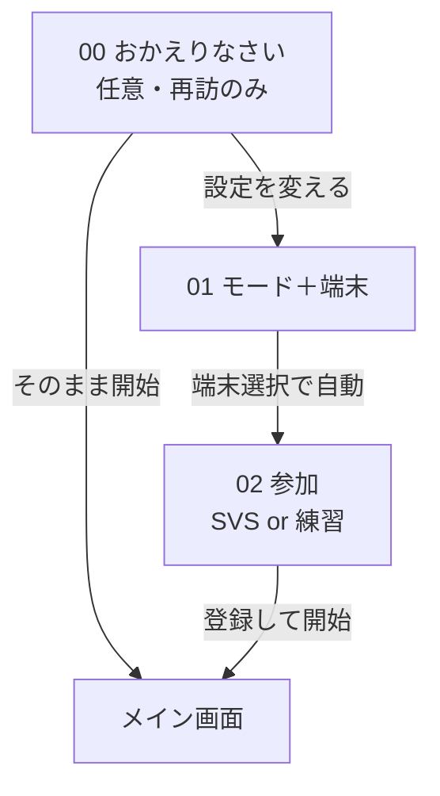

# オンボーディング デザイン仕様（Figma 用）

| 項目 | 内容 |
|------|------|
| 対象 | `player.html` 入口〜参加〜登録 |
| フレーム幅 | **390px**（iPhone 14 基準） |
| ページ余白 | 左右 **10px**（`body` padding） |
| 方針 | 画面 **最大2枚**、確認ダイアログなし、選んだら下に展開 |

---

## Figma ファイル構成（推奨）

```
UTC-Web-Design
└─ Player-Onboarding
   ├─ 00_QuickStart（再訪）
   ├─ 01_Entry（モード＋端末）
   ├─ 02_Join_SVS
   ├─ 02_Join_Drill_Create
   ├─ 02_Join_Drill_Join
   ├─ 02_Join_Role_Expanded（同盟/ルーム選択後）
   └─ Components
      ├─ Card / ModeCard / EnvButton / AllianceRow
      ├─ RoleButton / PrimaryCTA / FieldError
      └─ QuickStartPanel
```

---

## デザイントークン（Variables）

| 名前 | 値 | 用途 |
|------|-----|------|
| `color/bg-app` | `#1E1E1E` | 画面背景 |
| `color/bg-card` | `#282C34` | カード |
| `color/bg-inset` | `#1E2227` | 練習ルーム枠・入力背景 |
| `color/border` | `#3E4451` | 枠線 |
| `color/text-primary` | `#D7DEE9` | 見出し |
| `color/text-muted` | `#ABB2BF` | 補足 |
| `color/accent-blue` | `#61AFEF` | リンク・選択リング |
| `color/accent-gold` | `#E5C07B` | SVS・参謀 |
| `color/accent-drill` | `#C678DD` | 同盟の練習 |
| `color/accent-green` | `#98C379` | 成功・そのまま開始 |
| `color/accent-red` | `#E06C75` | エラー・1台端末 |
| `color/env-2device` | `#4CAF50` | 別端末ボタン背景 |
| `radius/card` | 12px | |
| `radius/button` | 8–10px | |
| `space/card-pad` | 20px | カード内 padding |
| `space/stack` | 10–14px | 縦 gap |
| `touch/min-height` | **48px** | 全タップ要素 |
| `font/body` | sans-serif 13–16px | |
| `font/title` | bold 17–18px | |

---

## フロー図



---

## 00 — おかえりなさい（`quickStartPanel`）

**表示条件:** 前回設定が揃っているときのみ（実装済み `canQuickStart()`）

### レイアウト（390×可変）

| 要素 | 仕様 |
|------|------|
| 外枠 | `bg-inset`、border **2px** `#98C379`、`radius` 10px、padding 14px |
| タイトル | 「おかえりなさい」— 15px bold `#98C379` |
| サマリー | 13px `#ABB2BF`、例: `前回: 同盟の練習 / 別端末 / MTC練習 / 乗り手` |
| 主ボタン | 全文「そのまま開始」— 高さ 48px、背景 `#98C379`、文字 `#1E2227` 16px bold |
| 副ボタン | 「設定を変える」— 高さ 40px、`#3E4451` / `#ABB2BF` 14px |

**Figma:** `00_QuickStart / default` の1フレームで十分。

---

## 01 — 入口（`step1_intro`）

### カード共通

- 幅: **370px**（390 − 20 padding）
- 背景 `#282C34`、border 1px `#3E4451`、radius 12px、padding 20px

### ブロック順（上から）

#### A. モード選択

| 要素 | 仕様 |
|------|------|
| ヒント | 12px `#ABB2BF` 中央寄せ、2行:<br>「どちらで使いますか？」<br>「※普段は「同盟の練習」、SVSの日は下を選択」 |
| カード間 gap | 10px |

**ModeCard — 同盟の練習（上・デフォルト選択）**

| 状態 | border | 背景 |
|------|--------|------|
| selected | 2px `#C678DD` | `rgba(198,120,221,0.12)` |
| default | 2px `#3E4451` | `#1E2227` |

- タイトル: 17px bold `#C678DD`「同盟の練習」
- 説明: 13px `#ABB2BF`「自同盟だけの部屋。普段の打ち合わせ・訓練用」
- padding: 14px 16px、min-height 48px、**左寄せ**

**ModeCard — SVS（下）**

| 状態 | border | 背景 |
|------|--------|------|
| selected | 2px `#E5C07B` | `rgba(229,192,123,0.10)` |
| default | 2px `#3E4451` | `#1E2227` |

- タイトル: 17px bold `#E5C07B`「SVS（3301全体）」
- 説明: 「4週に1回のサーバー対抗戦。全同盟が同じ戦場で使用」

#### B. Chrome 注意（折りたたみ）

| 状態 | UI |
|------|-----|
| 2回目以降 | 1行: 「ブラウザはChrome等で開いてください。」+ リンク「注意を表示」12px `#61AFEF` 下線 |
| 初回展開 | 赤枠 2px `#E06C75`、背景 `rgba(224,108,117,0.1)`、見出し＋説明＋URLコピー行 |

#### C. 端末確認

| 要素 | 仕様 |
|------|------|
| 見出し | h2 相当、色 `#61AFEF`「ご利用環境の確認」 |
| 本文 | 16px 中央、「別々の端末（スマホとPC等）」のみ `#E5C07B` bold |
| ボタン1 | 「💻 はい（別端末で開ける）」— 幅 80%、高さ 48px、背景 `#4CAF50`、白文字 |
| ボタン2 | 「📱 いいえ（スマホ1台のみ）」— 同上、背景 `#E06C75` |
| 選択中 | `box-shadow: 0 0 0 2px #61AFEF`（`env-btn-selected`） |

**挙動（実装済み・デザインは変えない）:** 端末タップ → 自動で画面02へ（「次へ」なし）

### Figma フレーム

- `01_Entry / mode-drill-selected`
- `01_Entry / mode-svs-selected`
- `01_Entry / chrome-expanded`（初回用）

---

## 02 — 参加（`step2_5_alliance`）

### 共通ヘッダー

| 要素 | SVS | 練習 |
|------|-----|------|
| 見出し h3 | 「参加する同盟を選ぶ」 | 「同盟の練習ルームに参加」 |
| 戻る | 下部「◀ モード・端末の選択に戻る」— `#3E4451` 80%幅 高さ 40px |

### 1台端末バナー（`oneDeviceClockBanner`）

- 表示: 端末＝1台のみ
- 枠: 1px `#E06C75`、`bg-inset`、padding 10–12px、13px 左寄せ
- コピー: 「**スマホ1台:** 上部の日本時間と手元の時計を**秒まで**合わせてから登録してください。」

### グローバルエラー（`onboardingFormError`）

- 13px `#E06C75`、背景 `rgba(224,108,117,0.1)`、padding 8px、radius 6px
- **確認ダイアログは使わない**

---

### 02a — SVS（`prodAlliancePick`）

#### 同盟リスト（未決定時 `---`）

3行リスト（縦積み、gap 6px）:

| 状態 | 見た目 |
|------|--------|
| default | 背景 `#3E4451`、文字 `#ABB2BF`、高さ 48px、radius 8px |
| selected | 背景 `#61AFEF`、文字白、**左バー不要**（全面ハイライトでOK） |
| ラベル | `---` / 決定後は `MTC` 等（管理画面から更新） |

**改善提案（Figmaで採用推奨）:**

- 各行的中: 16px bold
- 未選択時は薄く、選択時のみ `#61AFEF`（現行 `role-btn` と同系）

#### 役割エリア（`roleSetupSection`）— 同盟タップ後に同一カード内表示

| 区切り | 上 border 1px `#3E4451`、margin-top 14px、padding-top 14px |
| 同盟表示 | 18px bold `#98C379`「【 MTC 】」中央 |
| 見出し | 「役割を選択」 |
| 参謀 | 背景 `#E5C07B`、文字 `#282C34` |
| 集結主1/2・乗り手 | inactive `#3E4451` / active `#61AFEF` |
| 参謀→班 | inset カード内に第1班/第2班/乗り手 横並び wrap、各 min-height 44px |
| 入力 | 名前・行軍（集結主のみ） |
| CTA | 「登録して開始」— **幅 80%**、高さ 48px、`#61AFEF` 白文字 |

**Figma フレーム:**

- `02_Join_SVS / alliance-default`（---×3、役割非表示）
- `02_Join_SVS / role-expanded`（MTC選択＋役割表示）
- `02_Join_SVS / staff-role-picker`（参謀＋班選択）

---

### 02b — 同盟の練習（`drillConfigArea`）

#### コンテナ

- `bg-inset`、border 1px `#3E4451`、radius 8px、padding 10px、**左寄せ**

#### タブ

| タブ | active | inactive |
|------|--------|----------|
| 新規作成 | `#98C379` 系（btn-green） | `#3E4451` |
| ルーム参加 | 同上 | 同上 |
| 高さ | 48px | flex 1:1 |

#### 入力

- 高さ 40px+、背景 `#181A1F`、border `#3E4451`、placeholder `#ABB2BF` 12px
- エラー行: 12px `#E06C75`（フィールド直下）

#### ステータス（`drillStatusMsg`）

- 成功: 12px `#98C379`「ルームを作成しました。下の役割を選んでください。」
- 失敗: 同上 `#E06C75`

#### 作成/参加後

- **画面遷移なし** → 直下に `roleSetupSection` を表示（SVSと同じコンポーネント）

**Figma フレーム:**

- `02_Join_Drill_Create / empty`
- `02_Join_Drill_Create / validation-error`
- `02_Join_Drill_Join / room-list`
- `02_Join_Drill / role-expanded`

---

## コンポーネント寸法（Components）

### `Card`

- 幅: Fill 370px（親 390 − margin）
- padding: 20px
- gap 子要素: 14px

### `PrimaryCTA`（登録して開始 / そのまま開始）

| 種別 | 背景 | 文字 |
|------|------|------|
| 登録 | `#61AFEF` | 白 |
| クイック | `#98C379` | `#1E2227` |
| 高さ | 48px | 16px bold |

### `AllianceRow`（SVS用・提案）

- 高さ 48px、radius 8px、幅 100%
- Selected: `#61AFEF`
- Default: `#3E4451`

---

## やらないこと（デザイン固定）

- 同盟選択の **OK？確認ダイアログ**
- `step2_sync` 専用画面の復活
- 役割選択の **別カード／別画面** への遷移
- 参謀パネルと混同した表示順（オンボーディングは本仕様のみ）

---

## 実装との対応表

| Figma フレーム | HTML id / class |
|----------------|-----------------|
| 00_QuickStart | `#quickStartPanel` |
| 01_Entry | `#step1_intro` |
| 02 Join | `#step2_5_alliance` |
| 同盟 SVS | `#prodAlliancePick` `.role-btn` |
| 練習 | `#drillConfigArea` |
| 役割展開 | `#roleSetupSection` |

---

## 次のステップ

1. 上記フレームを Figma に作成（390px）
2. フレーム URL をチャットに貼る
3. 「`docs/design_onboarding.md` に合わせて `player.html` を実装」と依頼

優先フレーム: **`02_Join_SVS / role-expanded`** と **`01_Entry / mode-drill-selected`**（利用頻度が高いため）
