# 3301 操作仕様まとめ（確認・指示用）

本資料は、プレイヤー画面・総指揮画面・操作者ロジックの**現状仕様**を図解したものです。  
Agent への修正指示や、仕様確認のたびに参照してください。

**関連ルール（コード側の固定仕様）**

- `.cursor/rules/operator-logic-guard.mdc` — 差込・入替・集結・占領抜き
- `.cursor/rules/scope-only-user-requests.mdc` — 依頼範囲のみ実施
- `.cursor/rules/vps-production.mdc` — 本番は VPS のみ

**本番 URL**

- プレイヤー: https://3301-svs.jp/
- 総指揮: https://3301-svs.jp/staff_hq_3301

**維持ルール:** `.cursor/rules/operation-spec-doc.mdc` — コード修正のたびに本ファイルのスナップショット・更新履歴を Agent が更新する。

**UI 仕様:** [`docs/ui_spec_summary.md`](ui_spec_summary.md) — §0〜§8 画面、**§9 指示系 UI（総指揮・参謀→プレイヤー）**、§10 表示データ。

**スクショ付き**

| 資料 | 内容 |
|------|------|
| [**user_manual.md**](user_manual.md) | 操作説明書 |
| [**operation_spec_visual.md**](operation_spec_visual.md) | **本資料のビジュアル版** |
| [**ui_spec_visual.md**](ui_spec_visual.md) | UI 仕様ビジュアル版 |
| [screenshots/](screenshots/) | 本番 PNG |

Figma: [`docs/design_onboarding.md`](design_onboarding.md)。

---

## 現状スナップショット（毎回更新）

| 項目 | 現状（2026-05-20） |
|------|---------------------|
| **最終更新** | 2026-05-23 |
| **直近の変更** | ビジュアル版 [`operation_spec_visual.md`](operation_spec_visual.md) 追加 |
| **呼称** | UIは **役割・総指揮・参謀・集結主・乗り手** のみ（司令官/司令塔/リーダー/班長 禁止） |
| **本番モード** | drill（同盟練習ルーム）/ prod（SVS・XYZ/MTC/APL） |
| **操作者ロジック** | ins / swap / gorei / wd_manual — `operator-logic-guard` 固定 |
| **1台運用** | 自動号令音声なし（2device のみ `handleVoice`） |
| **QA必須** | `op_operator_mandatory_bundle` PASS |

---

## 0. 3301 全体の入口

> **スクショ:** [operation_spec_visual.md §0](operation_spec_visual.md#0-全体の入口)

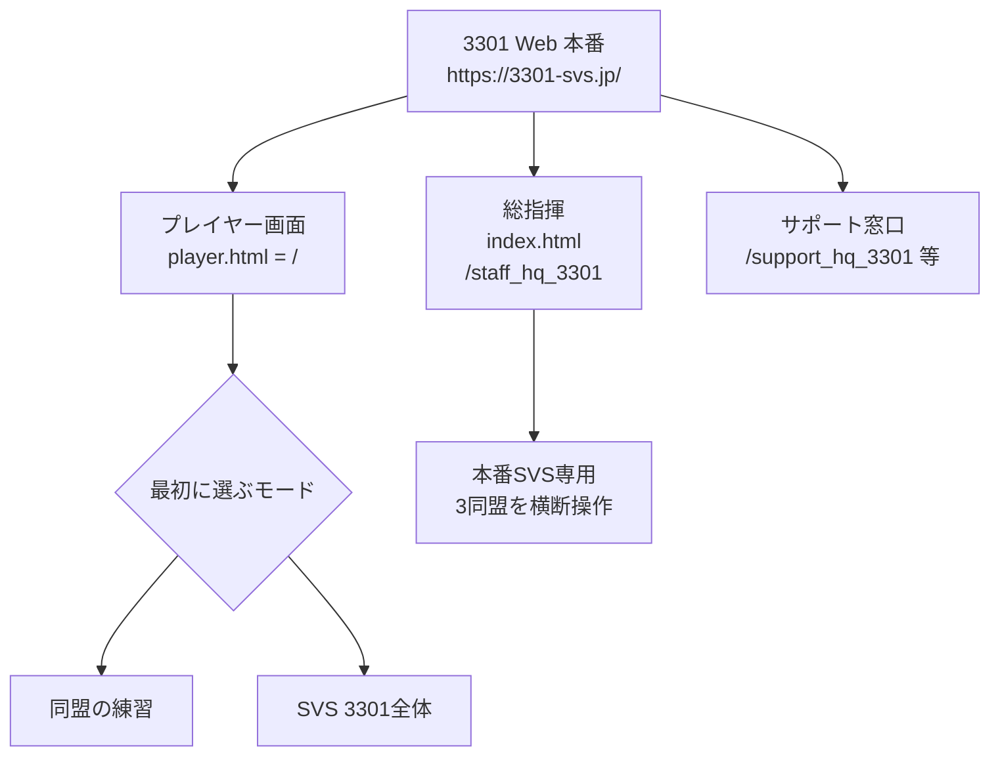
```mermaid
flowchart TB
    Root[3301 Web 本番\nhttps://3301-svs.jp/]

    Root --> Player[プレイヤー画面\nplayer.html = /]
    Root --> HQ[総指揮\nindex.html\n/staff_hq_3301]
    Root --> Support[サポート窓口\n/support_hq_3301 等]

    Player --> ModePick{最初に選ぶモード}
    ModePick --> Drill[同盟の練習]
    ModePick --> Prod[SVS 3301全体]

    HQ --> ProdOnly[本番SVS専用\n3同盟を横断操作]
```

| 画面 | 誰が使う | 役割 |
|------|----------|------|
| **プレイヤー** (`/`) | 同盟員・参謀 | 登録・CD表示・参謀パネル（練習） |
| **総指揮** (`/staff_hq_3301`) | 総指揮・参謀PC | 全同盟へ号令・差込・入替・抜きの**指示を出す** |
| **サポート** | 困った人 | 質問・SOS（ゲーム操作とは別） |

---

## 1. 共通：オンボーディング（どちらのモードも同じ流れ）

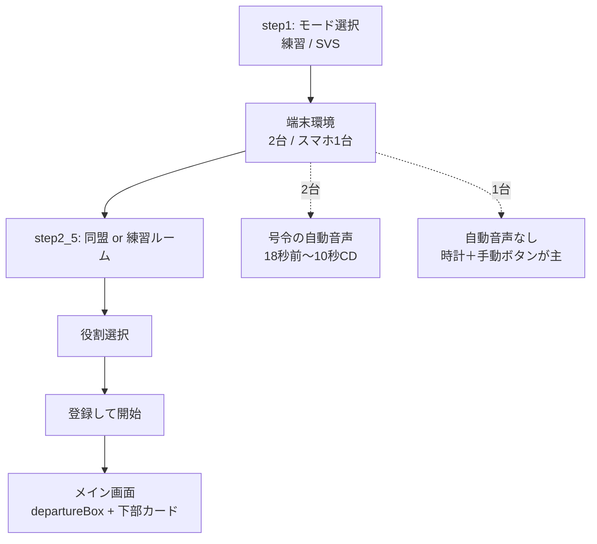
```mermaid
flowchart TD
    S1[step1: モード選択\n練習 / SVS]
    S1 --> S1b[端末環境\n2台 / スマホ1台]
    S1b --> S25[step2_5: 同盟 or 練習ルーム]
    S25 --> Role[役割選択]
    Role --> Reg[登録して開始]
    Reg --> Main[メイン画面\ndepartureBox + 下部カード]

    S1b -.->|2台| VoiceON[号令の自動音声\n18秒前〜10秒CD]
    S1b -.->|1台| VoiceOFF[自動音声なし\n時計＋手動ボタンが主]
```

**確認ポイント**

- **スマホ1台** (`deviceMode === '1device'`) では、大きなCDに加え**日本時間の時計**と「お手元の時計でボタン」が前提。
- **自動カウント音声**（10,9,…スタート）は **`2device` のときのみ** `handleVoice` が動く。

---

## 2. 枝① 同盟の練習（drill）

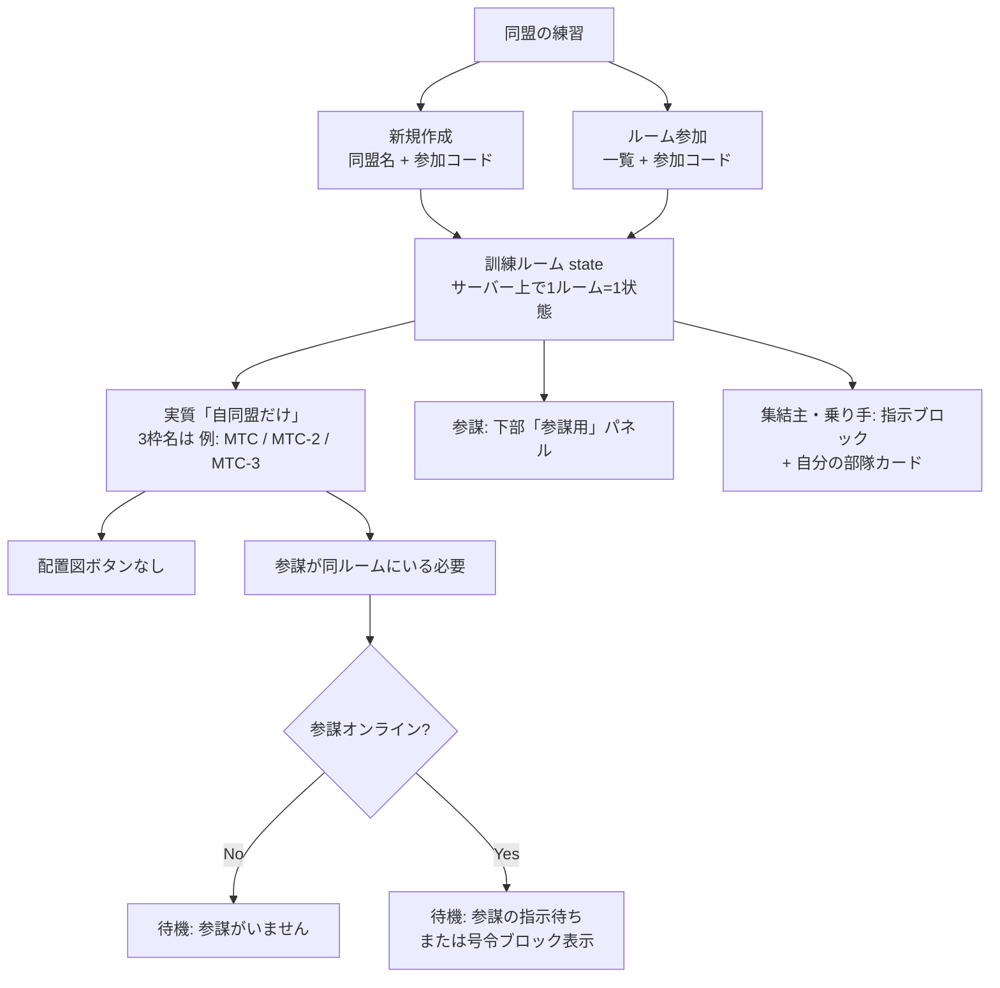
```mermaid
flowchart TB
    Drill[同盟の練習]

    Drill --> Create[新規作成\n同盟名 + 参加コード]
    Drill --> Join[ルーム参加\n一覧 + 参加コード]

    Create --> Room[訓練ルーム state\nサーバー上で1ルーム=1状態]
    Join --> Room

    Room --> OneAln[実質「自同盟だけ」\n3枠名は 例: MTC / MTC-2 / MTC-3]
    OneAln --> NoMap[配置図ボタンなし]
    OneAln --> StaffNeed[参謀が同ルームにいる必要]

    StaffNeed --> WaitStaff{参謀オンライン?}
    WaitStaff -->|No| Msg1[待機: 参謀がいません]
    WaitStaff -->|Yes| Msg2[待機: 参謀の指示待ち\nまたは号令ブロック表示]

    Room --> StaffPanel[参謀: 下部「参謀用」パネル]
    Room --> PlayerView[集結主・乗り手: 指示ブロック\n+ 自分の部隊カード]
```

### 練習モードの操作分担

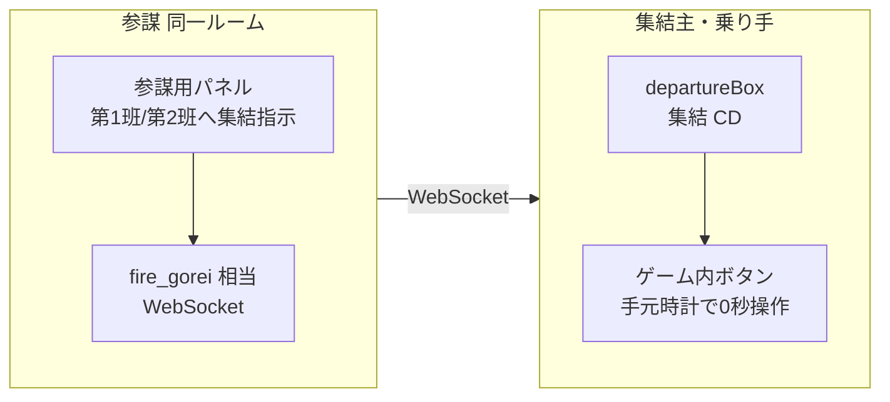
```mermaid
flowchart LR
    subgraph staff_drill [参謀 同一ルーム]
        SP[参謀用パネル\n第1班/第2班へ集結指示]
        SP --> FG[fire_gorei 相当\nWebSocket]
    end

    subgraph player_drill [集結主・乗り手]
        PV[departureBox\n集結 CD]
        PV --> Btn[ゲーム内ボタン\n手元時計で0秒操作]
    end

    staff_drill -->|WebSocket| player_drill
```

| 項目 | 練習の仕様 |
|------|------------|
| ルーム | 同盟名＋**参加コード**で隔離 |
| 同盟選択 | XYZ/MTC/APL の3択は**出ない** |
| 参謀 | **同じ訓練ルーム**に入り、役割「参謀」で登録 |
| 差込・入替・抜き | 総指揮画面は使わない想定。主に**集結号令**の練習 |
| バッジ表示 | 【同盟練習】 |
| 参謀テーブル列 | **出征開始まで**（集結スタートまでCD）／**集結時間**／**行軍時間**／**着弾時間**（▶UTC） |
| **号令時の集結時間** | 参謀パネルで **1分／5分** を切替（`set_default_rally`）。**訓練ルームのみ**（§4-1-K） |

### 2-1. 訓練ルームの作成・参加・選択（詳細）

オンボーディング **step2_5**（`#step2_5_alliance`）で、モードが **同盟の練習（drill）** のときだけ `#drillConfigArea` が表示される。SVS では XYZ/MTC/APL の3択（`#prodAlliancePick`）が出る。

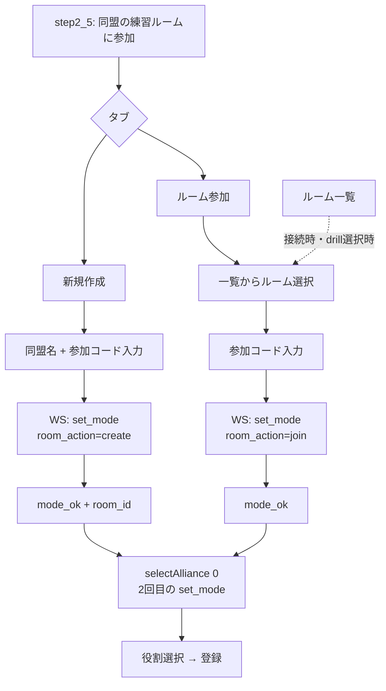
```mermaid
flowchart TD
    S25[step2_5: 同盟の練習ルームに参加]
    S25 --> Tab{タブ}
    Tab --> Create[新規作成]
    Tab --> Join[ルーム参加]

    Create --> C1[同盟名 + 参加コード入力]
    C1 --> C2["WS: set_mode\nroom_action=create"]
    C2 --> C3[mode_ok + room_id]
    C3 --> C4[selectAlliance 0\n2回目の set_mode]
    C4 --> Role[役割選択 → 登録]

    Join --> J1[一覧からルーム選択]
    J1 --> J2[参加コード入力]
    J2 --> J3["WS: set_mode\nroom_action=join"]
    J3 --> J4[mode_ok]
    J4 --> C4

    List[ルーム一覧] -.->|接続時・drill選択時| J1
```

#### 画面 UI（プレイヤー `player.html`）

| 要素 | ID / 操作 | 内容 |
|------|-----------|------|
| 見出し | `#allianceStepTitle` | drill 時は **「同盟の練習ルームに参加」** |
| タブ | `#drillTabCreate` / `#drillTabJoin` | **新規作成** / **ルーム参加**（`setDrillTab`、選択は `localStorage.utc_drill_tab` に保存） |
| **新規作成** | `#drillAllianceNameInput` | 同盟名（例: MTC練習）。**必須**、最大24文字（サーバー側） |
| | `#drillRoomKeyInput` | **参加コード**（同盟内で口頭・チャット共有）。**必須**、最大32文字 |
| | ボタン「作成して入る」 | `createDrillRoom()` |
| **ルーム参加** | `#drillRoomSelect` | 公開中ルームの `<select>`。先頭は「ルームを選択」 |
| | `#drillJoinCodeInput` | 参謀などから共有された**参加コード**（作成時と同じ文字列） |
| | ボタン「選択ルームに参加」 | `joinDrillRoom()` |
| 状態表示 | `#drillStatusMsg` | 送信中・成功・エラー文言 |

**ルーム参加タブの一覧**

- 表示形式: **`{同盟名} ({接続人数}人)`**（例: `MTC練習 (3人)`）
- サーバーが `drill_rooms` 一覧を返すたびに `renderDrillRooms()` で更新
- **誰も接続していないルームは一覧から消え、サーバー上のメタデータも削除される**（後述）

#### 新規作成の流れ

1. ユーザーが **同盟名** と **参加コード** を入力し「作成して入る」
2. クライアントが WebSocket で送信（接続前ならキュー `pendingDrillModePayload` に積み、`connect` 後に再送）:

```json
{
  "cmd": "set_mode",
  "val": {
    "mode": "drill",
    "alliance_id": 0,
    "room_action": "create",
    "alliance_name": "<同盟名>",
    "room_code": "<参加コード>"
  }
}
```

3. サーバー（`main.py` `set_mode`）:
   - 同盟名・参加コードが空 → `mode_error`「訓練同盟名と参加コードを入力してください。」
   - 成功時: `room_id = uuid4().hex[:8]`（8文字）を発行
   - `drill_room_meta[room_id] = { name, code }`
   - `drill_rooms[room_id] = fresh_drill_state(同盟名)`（独立したゲーム状態）
   - 応答: 先に `{ "type": "mode_ok", ... }`、続けて同一リクエスト内で接続に `drill_key` を設定し `{ "type": "init", "data": ... }` も送る

4. クライアント `mode_ok` 受信時:
   - `drillRoomKey` / `selectedDrillRoomId` / `localStorage.utc_drill_room_key` を `room_id` で保存
   - 作成成功時はタブを **ルーム参加** に切替（一覧に自分のルームが出るため）
   - **`selectAlliance(0)`** を自動実行 → 役割選択 UI を表示

5. 参謀・集結主・乗り手は **役割を選び「登録して開始」**（以降は §1 共通フロー）

#### ルーム参加の流れ

1. **ルームを選択**（必須）＋ **参加コード**（必須）
2. 送信:

```json
{
  "cmd": "set_mode",
  "val": {
    "mode": "drill",
    "alliance_id": 0,
    "room_action": "join",
    "room_id": "<一覧の room_id>",
    "room_code": "<参加コード>"
  }
}
```

3. サーバー検証:
   | 条件 | 応答 |
   |------|------|
   | `room_id` が存在しない | `mode_error`「訓練ルームが見つかりません。」 |
   | `room_code` がメタと不一致 | `mode_error`「参加コードが違います。」 |
   | 成功 | `mode_ok` + `room_id` |

4. クライアントは `mode_ok` 後 **`selectAlliance(0)`** → 役割選択へ（作成時と同じ）

#### 作成/参加後の `set_mode`（2回目）

| 回 | きっかけ | 効果 |
|----|----------|------|
| **1回目** | `room_action: create` / `join` | ルーム発行・検証、`drill_key` 紐付け、`mode_ok` + `init` を返す（サーバーは**1リクエストで完了**） |
| **2回目** | クライアントが `mode_ok` 後に **`selectAlliance(0)`** | `room_action` なしの `set_mode` を再送。役割選択 UI（`#roleSetupSection`）を表示。`staff_enabled` / 登録 idx は再びクリアされる |

練習では **`alliance_id` は常に 0**（`selectAlliance` 内で drill 時は強制）。`state.alliance_names` は `[同盟名, 同盟名-2, 同盟名-3]`。画面上は **自同盟名のみ** 表示（XYZ/MTC/APL の3択は出さない）。

#### ルーム一覧の取得・掃除

| 項目 | 仕様 |
|------|------|
| 要求 | `set_mode` + `room_action: "list"` |
| 応答 | `{ "type": "drill_rooms", "rooms": [ { "room_id", "name", "online" }, ... ] }` |
| いつ送るか | WebSocket 接続直後（`onopen`）、`selectAppMode('drill')` 時、各 `tick`/`init` に `drill_rooms` が同梱される場合もある |
| `online` | その `room_id` を `drill_key` にしている **接続数** |
| 掃除 | 一覧取得時に **ルームを削除しない**（作成直後の TEST 等が消える不具合を防止） |
| `online` | WebSocket の `drill_key` 一致数。参謀のみ在室（`drill_staff.present`）のときは **最低 1** |
| 作成後 | 全訓練接続へ `drill_rooms` を即時ブロードキャスト（参加タブへすぐ反映） |
| 表示 | `<select>` の文言は **同盟名のみ**（例: `TEST`）。`(N人)` や `#xxxx` は付けない。同名ルームはサーバー側で **1件にまとめる**（接続数が多い方） |
| **自動QA** | `scripts/qa_feature_check.py` が本番WSで **作成→一覧(作成側)→一覧(参加側)→join** を実行（`ws_drill_list_*` / `ws_drill_join`） |
| 再取得 | 「ルーム参加」タブ表示時・`goToJoinStep`・参加失敗時にクライアントが `list` を再送 |

#### サーバー側データ（メモリ）

| 変数 | 内容 |
|------|------|
| `drill_room_meta[room_id]` | `{ "name": 同盟表示名, "code": 参加コード }` |
| `drill_rooms[room_id]` | そのルーム専用の `state`（タイマー・号令・`default_rally` 等）。本番 `state` とは**別オブジェクト** |
| 接続 `connections[ws]` | `mode: "drill"`, `drill_key: room_id`, `drill_alliance`, `staff_enabled` 等 |

WebSocket 接続 URL 例: `/ws?mode=drill&aln=0&room=<room_id>`（`room` は `drillRoomKey`、未参加時は `default` のまま接続しうる）

#### ブラウザ保存（`localStorage`）

| キー | 用途 |
|------|------|
| `utc_app_mode` | `drill` / `prod` |
| `utc_drill_tab` | `create` / `join`（タブの復元） |
| `utc_drill_alliance_name` | 作成時の同盟名 |
| `utc_drill_join_code` | 参加コード（作成・参加共通） |
| `utc_drill_room_key` | 参加中ルーム ID（8文字）。**クイック再開に必須** |
| `utc_last_role` / `utc_is_staff_commander` 等 | 役割・参謀フラグ（§1 共通） |

**クイック再開**（`canQuickStart`）: drill では `utc_drill_room_key` が有効（`default` 以外）かつ `utc_drill_join_code` があること、などを満たすと前回設定で `register()` まで進める。

#### エラー表示（ユーザー向け）

| サーバー `mode_error` | 画面 |
|----------------------|------|
| 訓練ルームが見つかりません | 「参加に失敗しました。ルーム一覧を選び直してください。」＋ `#drillStatusMsg` |
| 参加コードが違います | サーバー文言を `#drillStatusMsg` に表示 |
| その他 | オンボーディング全体エラー `#onboardingFormError` にも出す場合あり |

#### 参謀・メンバーが揃う前提

- **参謀**も同じ **room_id**（同じ参加コードで join、または作成者が共有）で入る
- ルーム内参謀の在席は `drill_staff.present`（`drill_staff_status_for_room`: `staff_enabled` かつ `a_id==0` の接続が1人以上）
- 集結主・乗り手は参謀がいない間 **待機表示**（§2 図参照）

#### 実装参照

| 処理 | ファイル |
|------|----------|
| 作成・参加 UI / `mode_ok` | `player.html` — `createDrillRoom`, `joinDrillRoom`, `renderDrillRooms`, `selectAlliance` |
| `set_mode` create/join/list | `main.py` — `process_command` |
| 公開一覧・掃除 | `main.py` — `get_public_drill_rooms` |
| 初期ルーム state | `main.py` — `fresh_drill_state` |

---

## 3. 枝② SVS（3301全体・prod）

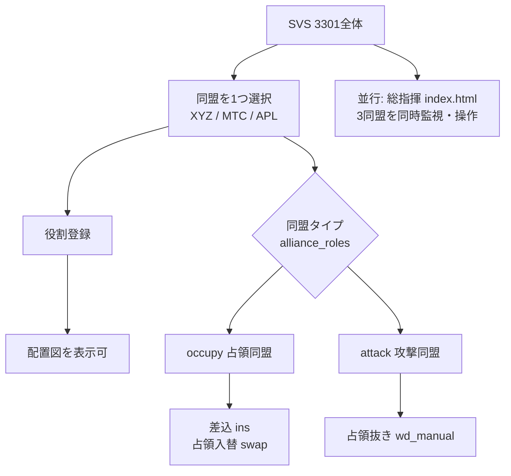
```mermaid
flowchart TB
    Prod[SVS 3301全体]

    Prod --> Pick[同盟を1つ選択\nXYZ / MTC / APL]
    Pick --> Role2[役割登録]
    Role2 --> Map[配置図を表示可]

    Prod --> HQLink[並行: 総指揮 index.html\n3同盟を同時監視・操作]

    Pick --> RoleType{同盟タイプ\nalliance_roles}
    RoleType --> Occupy[occupy 占領同盟]
    RoleType --> Attack[attack 攻撃同盟]

    Occupy --> OccFeat[差込 ins\n占領入替 swap]
    Attack --> AtkFeat[占領抜き wd_manual]
```

### SVS：総指揮 → プレイヤー

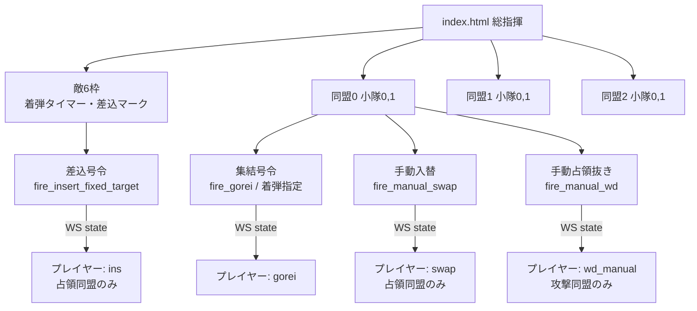
```mermaid
flowchart TB
    HQ[index.html 総指揮]

    HQ --> E6[敵6枠\n着弾タイマー・差込マーク]
    HQ --> A0[同盟0 小隊0,1]
    HQ --> A1[同盟1 小隊0,1]
    HQ --> A2[同盟2 小隊0,1]

    E6 --> InsCmd[差込号令\nfire_insert_fixed_target]
    A0 --> Gorei[集結号令\nfire_gorei / 着弾指定]
    A0 --> ManSwap[手動入替\nfire_manual_swap]
    A0 --> ManWd[手動占領抜き\nfire_manual_wd]

    InsCmd -->|WS state| PIns[プレイヤー: ins\n占領同盟のみ]
    Gorei -->|WS state| PGorei[プレイヤー: gorei]
    ManSwap -->|WS state| PSwap[プレイヤー: swap\n占領同盟のみ]
    ManWd -->|WS state| PWd[プレイヤー: wd_manual\n攻撃同盟のみ]
```

| 項目 | SVSの仕様 |
|------|-----------|
| 同盟名 | 既定 XYZ / MTC / APL（管理画面で変更可） |
| バッジ表示 | 【SVS】 |
| 本番配信 | VPS のみ（`config/production.json`） |
| **号令時の集結時間** | **現状 300秒（5:00）** — 練習と同じ `default_rally`（§4-1-K）。総指揮で **5分⇔1分 切替** 可 |

---

## 4. 操作者ロジック4種（固定仕様）

> **無断変更禁止。** 修正はユーザー明示指示＋`operator-logic-guard` 準拠の最小差分のみ。

### 4-1 集結号令（gorei）

**呼称（UI）:** 役割・総指揮・参謀・集結主・乗り手 のみ。司令官／司令塔／リーダー／班長 は使わない。

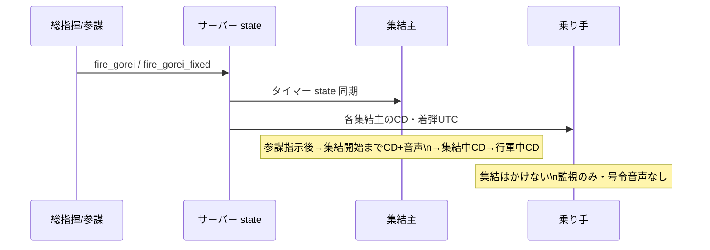
```mermaid
sequenceDiagram
    participant HQ as 総指揮/参謀
    participant S as サーバー state
    participant Sh as 集結主
    participant Ri as 乗り手

    HQ->>S: fire_gorei / fire_gorei_fixed
    S->>Sh: タイマー state 同期
    S->>Ri: 各集結主のCD・着弾UTC
    Note over Sh: 参謀指示後→集結開始までCD+音声\n→集結中CD→行軍中CD
    Note over Ri: 集結はかけない\n監視のみ・号令音声なし
```

| タイミング | 集結主（第1・第2） | 乗り手 |
|------------|-------------------|--------|
| **参謀指示後すぐ** | **集結開始まで** CD＋音声（2device） | **乗り手**／**集結準備中**／CD／「集結主が集結準備中です。」・音声なし |
| **集結主が集結開始** | **集結中** CD表示 | **乗り手**／**集結中**／CD／「集結主が集結中です。」 |
| **集結CD0・行軍開始** | **行軍中** CD表示 | **乗り手**／**行軍中**／CD／「集結主が行軍中です。」 |

| 項目 | 仕様 |
|------|------|
| 号令の出し方 | **総指揮**が小隊ごとに号令ボタン。練習は**参謀**が参謀パネルから |
| 表示 | **号令後もブロック維持**（着弾 UTC） |
| 集結主 | 集結ボタンを押すタイミング＝`state` 4→1→2 に応じたラベル |
| 乗り手 | 上から **乗り手 → 状態（集結中など）→ CD → 説明1行 → 着弾時間**。下部の※注釈なし。号令音声なし |
| 1台表示 | 集結主: 集結のタイミング／乗り手: 各集結主のタイミング |
| 音声 | 集結主の **pre_rally（集結開始まで）** のみ 18秒前→10〜1→スタート |
| WS | `fire_gorei` / `force_gorei` / `gorei_last_target` |

#### 4-1-A モード共通の前提（練習・SVS 同じサーバー計算）

| 項目 | 内容 |
|------|------|
| **モード** | **同盟の練習（drill）** も **SVS 3301全体（prod）** も、集結号令の時刻計算は **同じ**（`main.py` の `fire_gorei` / `fire_gorei_fixed`） |
| **号令を出す側** | 練習＝**参謀**（プレイヤー画面・参謀用パネル）。SVS＝**総指揮**（`index.html`）または参謀 |
| **1〜6人の単位** | 同盟あたり **第1班・第2班** の各 **6枠**（タイマー index `6 + 小隊ID×6` 〜 +5）。**名前が入っている枠だけ**が対象 |
| **行軍時間** | 各枠の `sub_set`（秒）。登録時の「行軍時間を入力」が **集結主** の枠に書き込まれる |
| **集結時間（設定）** | 全員共通の **`default_rally`**（秒）。詳細は **§4-1-K** |
| **猶予** | 小隊ごとの `gorei_offsets[squadId]`（参謀 UI の「猶予+」秒） |

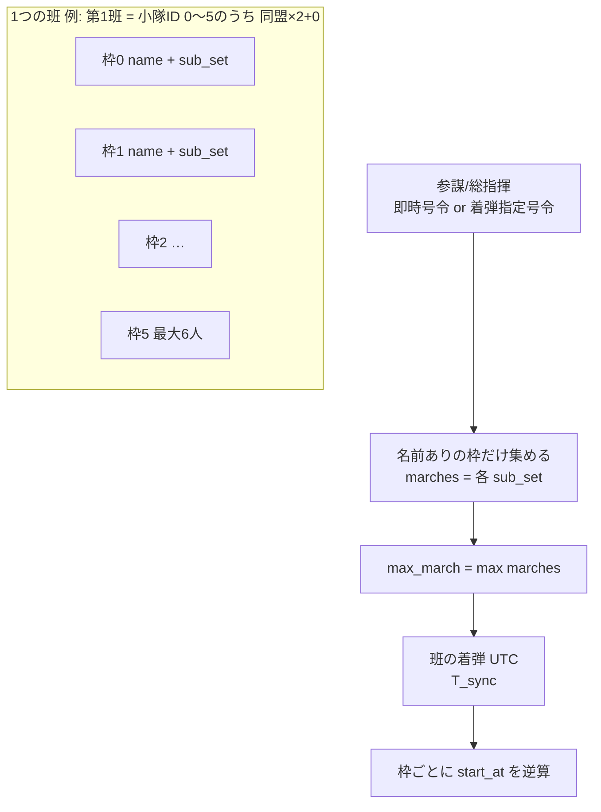
```mermaid
flowchart TB
    subgraph squad [1つの班 例: 第1班 = 小隊ID 0〜5のうち 同盟×2+0]
        S0[枠0 name + sub_set]
        S1[枠1 name + sub_set]
        S2[枠2 …]
        S5[枠5 最大6人]
    end

    Staff[参謀/総指揮\n即時号令 or 着弾指定号令]
    Staff --> Pick[名前ありの枠だけ集める\nmarches = 各 sub_set]
    Pick --> MaxM[max_march = max marches]
    MaxM --> Tland[班の着弾 UTC\nT_sync]
    Tland --> Each[枠ごとに start_at を逆算]
```

#### 4-1-B 「1〜6人」の該当の仕方（誰の行軍が効くか）

| # | ルール | 詳細 |
|---|--------|------|
| 1 | **対象枠** | その班の **6タイマー**のうち、`name` が空でない行だけ |
| 2 | **行軍の値** | 各行の **`sub_set`（秒）**。参謀テーブルの「行軍時間」列と同じ |
| 3 | **集結主が登録したとき** | 役割 **第1班集結主 / 第2班集結主** で登録すると、自分の名前が入った **最初の空き枠**（または同名の枠）に `name` と **`sub_set = 登録時の行軍秒`** が入る（`register_player`） |
| 4 | **乗り手が登録したとき** | 役割 **乗り手** は **6枠の `sub_set` には書き込まない**（名前のみサーバーに紐づく）。**班の max 行軍計算には乗り手登録だけでは加わらない** |
| 5 | **参謀が集結主/乗り手を選んで練習するとき** | 参謀用パネルで「第1班 集結主」等を選んで登録した場合も、**集結主なら行軍秒あり・乗り手なら行軍秒なし**（上と同じ） |
| 6 | **複数人が同じ班にいる場合** | 最大 **6名**まで別名義で枠を埋められる。号令時はその **6名分の `sub_set` の最大値**を使う |
| 7 | **誰も行軍が無いとき** | 名前付き枠があっても `marches` が空なら **`fire_gorei` は実行されない**（号令スキップ） |

**ポイント:** 「1〜6人」は **UI上の参謀テーブル6行**であり、**集結主ロールを6人取る**という意味ではない。6枠に登録された **部隊名＋行軍時間**の集合。

#### 4-1-C 集結スタート（`start_at`）が行軍の長短で変わる理由

参謀が号令したとき、班全体で **同じ着弾 UTC** に揃えるため、**行軍が長い人ほど早く**「集結ボタンまで」（`start_at`）が来る。

**記号（その班・号令直後）**

| 記号 | 意味 |
|------|------|
| `now` | 号令を出した UTC 時刻 |
| `O` | `gorei_offsets[班]`（猶予+） |
| `R` | `default_rally`（集結秒） |
| `M` | **`max(sub_set)`** — 名前あり枠の行軍の **最長** |
| `mᵢ` | 枠 *i* の `sub_set`（その人の行軍秒） |

**班の着弾（全員共通）**

```text
T_sync = now + O + R + M
```

（着弾指定号令 `fire_gorei_fixed` のときは、参謀が合わせた **固定 UTC** が `T_sync`）

**各人の集結スタート `start_at`（= 出征開始 / 集結ボタンまでの基準時刻）**

```text
start_at[i] = T_sync − mᵢ − R
```

（任意: 総指揮で「遅延マーク」した1枠だけ `T_sync` に **+1秒** — `delay_target_idxs`）

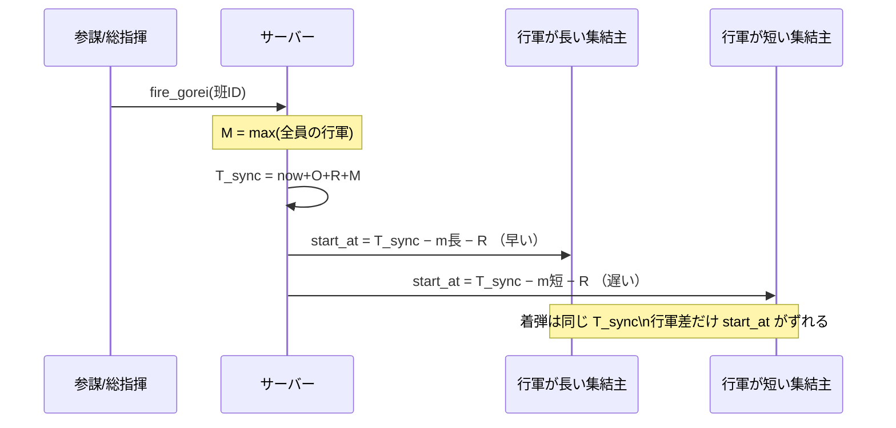
```mermaid
sequenceDiagram
    participant St as 参謀/総指揮
    participant S as サーバー
    participant L as 行軍が長い集結主
    participant Sd as 行軍が短い集結主

    St->>S: fire_gorei(班ID)
    Note over S: M = max(全員の行軍)
    S->>S: T_sync = now+O+R+M
    S->>L: start_at = T_sync − m長 − R （早い）
    S->>Sd: start_at = T_sync − m短 − R （遅い）
    Note over L,Sd: 着弾は同じ T_sync\n行軍差だけ start_at がずれる
```

| 行軍 | `M` への影響 | その人の `start_at` |
|------|----------------|---------------------|
| **班で最長** | その値が `M` になる | **一番早い**（他員より先に「集結開始まで」CDが終わる） |
| **班で短い** | `M` にはならないが | **遅い**（最長の人が出発する頃に合わせてスタート） |
| **同じ長さ** | 同じ `M` | 全員同じ `start_at`（+1秒遅延枠を除く） |

**参謀画面の列との対応（号令後・state=4）**

| 列 | 表示内容 |
|----|----------|
| **出征開始まで** | その枠の `start_at` までの CD（行軍が長いほど **早くカウントが始まる／残りが長く見える**） |
| **集結時間** | 号令前は設定 `R`（例 5:00）。集結中（state=1）は集結残り CD |
| **行軍時間** | その枠の `mᵢ`（設定値。行軍中は `sub_sec`） |
| **着弾時間** | その枠から見た **着弾 UTC**（`start_at + R + mᵢ`＋微調整 `off`） |

#### 4-1-D 役割別：集結主と乗り手（登録時の違い）

| 役割 | 行軍を班の6枠に載せるか | 集結スタート | 画面上部（departureBox） |
|------|------------------------|--------------|-------------------------|
| **集結主（第1班/第2班）** | **載せる**（`register_player` で `sub_set` 設定） | **自分の枠の `start_at`** に合わせて「集結開始まで」→ 集結中 → 行軍中 | 自分の班の号令ブロック＋**ゲーム内で集結ボタン** |
| **乗り手** | **載せない**（登録で `march_sec` を送らない） | 班の号令は **第1班・第2班のタイマー／`gorei_last_target`** から **見るだけ** | **乗り手／集結中／CD／説明／着弾時間**。集結ボタンは押さない |
| **参謀** | 号令時に **班の6枠の max 行軍** を参照 | 号令を **出す側**（下部参謀用パネル） | 参謀用パネルで第1班・第2班を操作。必要なら「参謀として参加」＋**集結主/乗り手を併用**可 |

**乗り手でも班のタイミングは行軍の長短で決まる** — ただし計算に使われるのは **その班の6枠に名前が入っている集結主（等）の `sub_set`** であり、**乗り手本人の行軍入力は参謀テーブルに無い**。

#### 4-1-E タイマー状態（集結スタート以降）

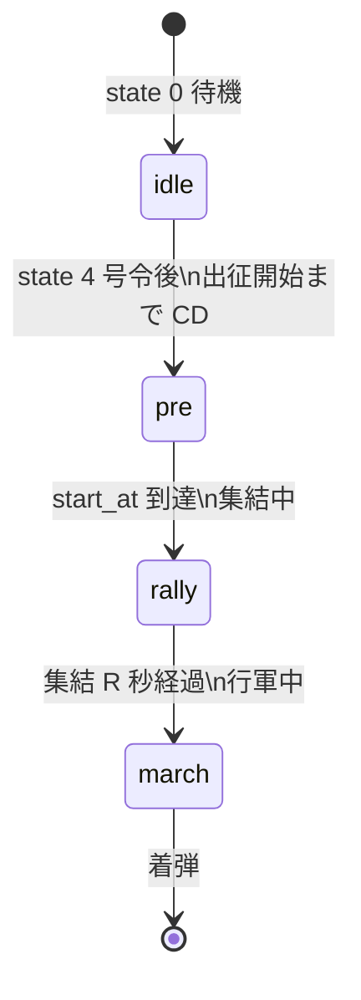
```mermaid
stateDiagram-v2
    [*] --> idle: state 0 待機
    idle --> pre: state 4 号令後\n出征開始まで CD
    pre --> rally: start_at 到達\n集結中
    rally --> march: 集結 R 秒経過\n行軍中
    march --> [*]: 着弾
```

| state | 意味 | 集結主の操作 |
|-------|------|--------------|
| **4** | `start_at` まで待つ（**集結開始まで**） | 手元時計／CDで **集結開始** |
| **1** | 集結 `R` 秒（**集結中**） | ゲーム内 **集結** |
| **2** | 行軍 `mᵢ` 秒（**行軍中**） | ゲーム操作 |

#### 4-1-F 実装参照（コード）

| 処理 | 場所 |
|------|------|
| `T_sync = now + O + R + max(marches)` | `main.py` — `fire_gorei` |
| `start_at = T_sync − sub_set − R`（枠ごと） | 同上 |
| 着弾指定 | `fire_gorei_fixed` — `gorei_fixed_targets[班]` を `T_sync` に |
| プレイヤー側プレビュー（参謀の即時号令） | `player.html` — `sendStaffGorei` |
| 班の着弾プレビュー最小値 | `_compute_squad_gorei_target_ts` — 各枠着弾の **min**（表示用） |

#### 4-1-G 即時号令（今のタイミング）

**UI:** 参謀パネル／総指揮画面の **「即時号令（今のタイミング）」**（第1班=紫系、第2班=水色系など班ごとの色）。  
**WebSocket:** `fire_gorei`（`idx` = **小隊ID** `0〜5`。第1班=同盟×2+0、第2班=+1）。

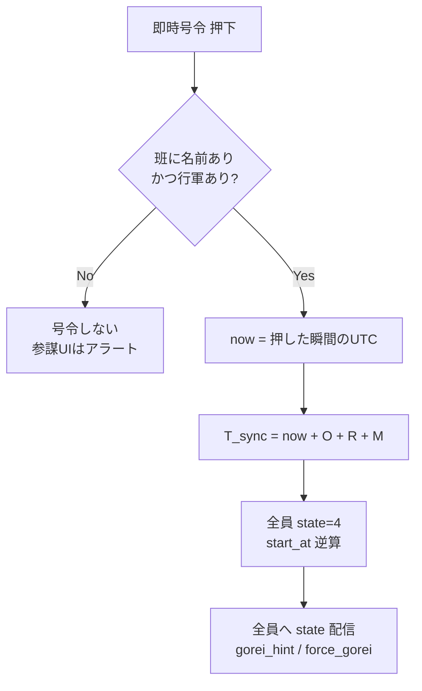
```mermaid
flowchart TD
    Btn[即時号令 押下]
    Btn --> Pre{班に名前あり\nかつ行軍あり?}
    Pre -->|No| Skip[号令しない\n参謀UIはアラート]
    Pre -->|Yes| Now[now = 押した瞬間のUTC]
    Now --> Tsync["T_sync = now + O + R + M"]
    Tsync --> Set[全員 state=4\nstart_at 逆算]
    Set --> Push[全員へ state 配信\ngorei_hint / force_gorei]
```

| 項目 | 仕様 |
|------|------|
| **いつ使うか** | **「今から」** 猶予・集結・最長行軍を足した最短着弾で班を動かしたいとき |
| **着弾時刻 `T_sync`** | **`T_sync = now + O + R + M`**（§4-1-C と同じ。`now` は**ボタンを押した瞬間**） |
| **`gorei_fixed_targets`**| **参照しない**。着弾の▲▼で未来時刻を入れていても、即時号令は**その設定を無視**して上式で決める |
| **猶予 `O`** | 即時でも **`gorei_offsets[班]` が加算される**（「猶予+」を先に入れておくと、号令後の着弾がその秒だけ遅れる） |
| **事前条件** | ① **参謀権限**（`set_staff_mode` で `staff_enabled`、練習は**自同盟の第1・第2班のみ**） ② その班の6枠に **名前が1人以上** ③ その人たちの **`sub_set` が取れる**（行軍未設定だけではサーバーがスキップ） |
| **号令後の処理** | 名前あり全枠: `state=4`、`start_at` 設定、`gorei_last_target[班]=T_sync`。続けて `gorei_hint` / `force_gorei` でクライアント同期 |
| **モード** | **練習・SVS 同一**（`main.py` 共通） |
| **総指揮画面** | 号令送信直前に `set_staff_mode` で **対象同盟** を付与（`alliance_id = floor(小隊ID/2)`）してから `fire_gorei` |

**即時号令だけの式（再掲）**

```text
now  = ボタン押下時刻（UTC）
T_sync = now + gorei_offsets[班] + default_rally + max(名前あり枠の sub_set)
start_at[i] = T_sync − sub_set[i] − default_rally   （各枠）
```

#### 4-1-H 着弾指定号令

**2段階** — ① **着弾 UTC を合わせる（任意・号令前）** ② **着弾指定号令ボタンで確定**

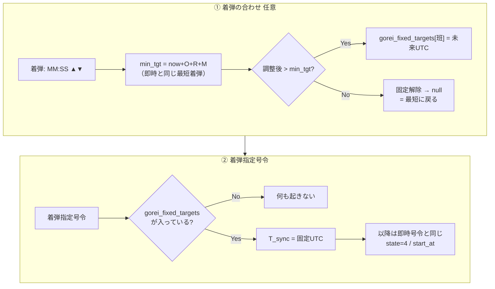
```mermaid
flowchart TD
    subgraph prep [① 着弾の合わせ 任意]
        Dial[着弾: MM:SS ▲▼]
        Dial --> MinT["min_tgt = now+O+R+M\n（即時と同じ最短着弾）"]
        MinT --> Fix{調整後 > min_tgt?}
        Fix -->|Yes| Store["gorei_fixed_targets[班] = 未来UTC"]
        Fix -->|No| Auto["固定解除 → null\n= 最短に戻る"]
    end
    subgraph fire [② 着弾指定号令]
        Btn2[着弾指定号令]
        Btn2 --> Has{gorei_fixed_targets\nが入っている?}
        Has -->|No| Noop[何も起きない]
        Has -->|Yes| Tfix["T_sync = 固定UTC"]
        Tfix --> Set2[以降は即時号令と同じ\nstate=4 / start_at]
    end
    prep --> fire
```

##### H-1 着弾時刻の合わせ（号令を出す**前**）

| 項目 | 仕様 |
|------|------|
| **UI** | **「着弾:」** の時刻桁（MM:SS）と ▲▼。参謀／総指揮で同型 |
| **コマンド** | `mod_gorei_target`（`val` = 加算秒。UI: **+600 / +60 / +10 / +1** およびマイナス） |
| **最短着弾 `min_tgt`** | **`min_tgt = now + O + R + M`**（即時号令の `T_sync` と同じ下限） |
| **現在値** | 固定が無いときは **`min_tgt` から表示開始**。固定ありときは **`gorei_fixed_targets[班]`** |
| **保存条件** | 調整後 `new_tgt > min_tgt` のときだけ **`gorei_fixed_targets[班] = new_tgt`**（未来の着弾に固定） |
| **固定解除** | 調整で `new_tgt ≤ min_tgt` になったら **`gorei_fixed_targets[班] = null`**（自動＝最短に戻る） |
| **表示色** | 固定なし: **青系 `#61AFEF`**。固定あり: **黄 `#E5C07B`**（参謀パネル） |
| **自動解除（サーバー）** | 毎 tick、**自然の最短 `min_tgt` が固定時刻に追いついた**（`gorei_fixed ≤ min_tgt`）ら **固定を null に戻す**（差込着弾指定と同型の「追いついたら自動へ」） |

##### H-2 着弾指定号令ボタン（確定）

| 項目 | 仕様 |
|------|------|
| **UI** | **緑ボタン「着弾指定号令」** |
| **コマンド** | `fire_gorei_fixed` |
| **前提** | **`gorei_fixed_targets[班]` が null でないこと**。未設定のまま押しても **サーバーは return（号令なし）** |
| **着弾 `T_sync`** | **`T_sync = gorei_fixed_targets[班]`**（参謀が合わせた **未来の UTC 着弾**） |
| **各人 `start_at`** | 即時号令と**同じ逆算**（`start_at = T_sync − mᵢ − R`、遅延枠 +1秒あり） |
| **即時との違い** | 即時は **`now` 基準**、着弾指定は **事前に入れた固定 UTC 基準**。猶予・行軍・集結の式は同じ |

##### H-3 解除

| 項目 | 仕様 |
|------|------|
| **UI** | **赤「解除」** |
| **コマンド** | `cancel_gorei` |
| **効果** | `gorei_fixed_targets[班]` と `gorei_last_target[班]` をクリア。班6枠を **`state=0`**（待機）に戻す。`cancel_trigger` 更新。`force_gorei` キャンセル通知 |

#### 4-1-I 即時号令 vs 着弾指定号令（一覧）

| 比較 | **即時号令** | **着弾指定号令** |
|------|-------------|-----------------|
| コマンド | `fire_gorei` | `fire_gorei_fixed` |
| `T_sync` の決め方 | **押した瞬間** `now+O+R+M` | **`gorei_fixed_targets` の固定 UTC** |
| 着弾▲▼ | 号令**前**の目安表示。即時押下時は**無視** | 号令**前**に **必須**（固定を入れてから押す） |
| 固定未設定で押す | — | **何もしない** |
| 猶予 `O` | 加算される | `min_tgt` 計算と、固定を**今より後**にする下限に使う |
| 行軍 `M` | 班の **max(sub_set)** | 同上 |
| 号令後のプレイヤー側 | 集結主: 集結開始までCD／乗り手: 監視のみ | **同じ** |
| 練習／SVS | **同じサーバー処理** | **同じ** |

**操作の流れ（参謀・1班の例）**

1. （任意）**猶予+** で `O` を調整 → 即時・着弾の両方の下限に効く  
2. **即時**なら → **即時号令** のみ  
3. **○分後に着弾**なら → **着弾:** を ▲▼ で未来に合わせ（黄表示）→ **着弾指定号令**  
4. やり直し → **解除**

#### 4-1-J 実装参照（号令種別）

| 処理 | 場所 |
|------|------|
| `fire_gorei` | `main.py` |
| `fire_gorei_fixed` | `main.py` |
| `mod_gorei` / `mod_gorei_target` | `main.py` |
| `cancel_gorei` | `main.py` |
| 固定の自動解除 `gorei_fixed ≤ min_tgt` | `main.py` — `broadcast_context` |
| 参謀 UI・ローカル先行反映 | `player.html` — `sendStaffGorei` |
| 総指揮 UI・`set_staff_mode` 付与 | `index.html` — `send()` |

#### 4-1-K 号令時の集結時間（`default_rally`）

**用語の整理**

| 呼び方 | 意味 |
|--------|------|
| **集結時間**（参謀テーブル列） | 号令前後の **集結フェーズ**に関する表示（設定秒 or 残りCD） |
| **`default_rally`（サーバー）** | 号令計算・集結フェーズ長の **基準秒数**。以下 **R** と表記 |

**現状（2026-05）：練習と SVS で切替 UI が分かれている**

| モード | 状態オブジェクト | **既定の R** | 切替 UI |
|--------|------------------|-------------|---------|
| **同盟の練習（drill）** | 訓練ルームごとの `drill_rooms[room]` | **300秒（5:00）** 初期 | 第1班の**着弾指定枠内** ☑**1分** / ☑**5分**（排他・ルーム共通） |
| **SVS 3301全体（prod）** | 本番 `state` | **300秒（5:00）** 固定運用 | **変更なし**（参謀プレイヤー画面に切替なし） |
| **総指揮** | 本番 `state` | **300秒（5:00）** | **従来どおり** `index.html` の **「⏱ 5分(切替)」**（60⇔300） |

> 練習の参謀切替は **`set_default_rally`**（`mode=drill` かつ参謀のみ）。SVS 参謀・総指揮の挙動は今回変更していない。

**初期化（コード）**

| 対象 | 初期値 |
|------|--------|
| 本番 `state` | `default_rally: 300` |
| 訓練 `fresh_drill_state()` | `default_rally: 300` |
| 待機中タイマー `timers[].sec` | **300**（集結待ちの表示用。R と連動） |

**切替 UI**

| 対象 | コマンド | 動作 |
|------|----------|------|
| **同盟の練習・参謀** | `set_default_rally`（`val`: **60** or **300**） | チェックで **1分** or **5分** を明示設定。訓練ルームの `default_rally` のみ更新 |
| **総指揮（SVS）** | `toggle_rally` | **300 ⇔ 60** のトグル（**今回変更なし**） |

| 共通 | 仕様 |
|------|------|
| 影響範囲 | 練習は**その訓練ルーム**、本番は**全同盟共有 state** |
| 待機枠 | `state===0` の `sec` を新しい R に揃える |
| 号令・進行中 | **既に号令済み**の枠はその場の `end` 等を優先（切替は**次の号令以降**の基準） |

**号令計算での R（即時・着弾指定 共通）**

§4-1-C の **R** はすべて **`state.default_rally` の現在値**。

```text
T_sync = … + R + M          （着弾までの式に集結秒が入る）
start_at[i] = T_sync − mᵢ − R
min_tgt（着弾指定の下限）= now + O + R + M
```

| 号令種別 | R の効き方 |
|----------|------------|
| **即時号令** | 押下時点の **R** で `T_sync` を決める |
| **着弾指定** | `min_tgt` の計算と、固定着弾の下限に **R** が入る。確定時の `start_at` 逆算にも同じ **R** |

**号令後のゲーム内「集結」フェーズ（サーバー自動遷移）**

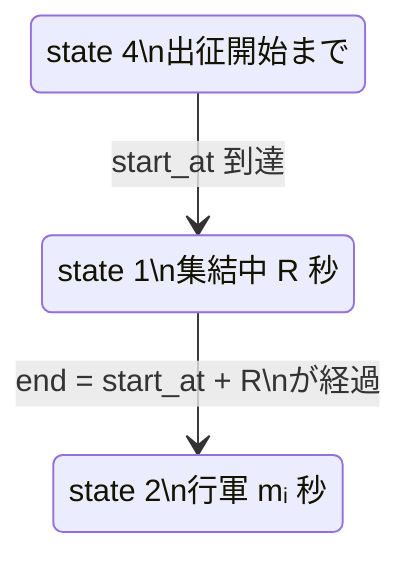
```mermaid
stateDiagram-v2
    state4: state 4\n出征開始まで
    state1: state 1\n集結中 R 秒
    state2: state 2\n行軍 mᵢ 秒
    state4 --> state1: start_at 到達
    state1 --> state2: end = start_at + R\nが経過
```

| 遷移 | サーバー処理（要約） |
|------|----------------------|
| 4 → 1 | `start_at` 到達で **集結開始**。`sec = R`、`end = start_at + R` |
| 1 → 2 | 集結 **R 秒**経過後、行軍 `sub_set` 秒へ（`sub_sec` カウント） |
| 解除 | `cancel_gorei` で各枠 `state=0`、`sec=R` に戻す |

**参謀テーブル「集結時間」列の見え方（号令後）**

| タイマー state | 列に出るもの |
|--------------|--------------|
| **4**（号令後・出征前） | 設定 **R** の固定表示（例 **5:00**） |
| **1**（集結中） | **集結終了（`end`）まで**の残り CD |
| **2**（行軍中） | **0:00** |
| **0**（待機） | 設定 **R** または `sec` |

**プレイヤー画面（集結主）**

| 表示 | R の関係 |
|------|----------|
| **集結開始まで** CD | `start_at` まで（R は間接的に着弾・start に効く） |
| **集結中** CD | 実際の残りは **`end − now`**（長さ ≒ 号令時の R） |
| **行軍中** CD | 行軍 `mᵢ`（R は終了済み） |

**練習 vs SVS — 現状まとめ（集結時間だけ）**

| | 同盟の練習 | SVS 3301全体 |
|---|------------|--------------|
| **今の秒数** | 参謀が **1分 or 5分** を選択（初期5分） | **5分（300秒）** デフォルト |
| **誰が変えられるか** | **参謀**（参謀用パネル上部チェック） | **総指揮**のみ 5分⇔1分（参謀UIは変更なし） |
| **参謀プレイヤー** | 選択した **R** で即時／着弾指定号令 | 本番 **R=300** で号令（自同盟2班） |

**実装参照**

| 項目 | 場所 |
|------|------|
| フィールド `default_rally` | `main.py` — `state` / `fresh_drill_state` |
| `toggle_rally` | `main.py`（総指揮） |
| `set_default_rally` | `main.py`（練習・参謀のみ） |
| 参謀 1分/5分（排他） | `player.html` — 着弾指定枠内 `buildStaffDrillRallyPickHtml` |
| 集結フェーズ 4→1→2 | `main.py` — `broadcast_context` |
| 参謀表 `computeRallySecForStaffRow` | `player.html` |
| 切替ボタン | `index.html`, `staff.html`（`#rallyToggleBtn`） |

---

### 4-2 差込（ins）— 占領同盟のみ

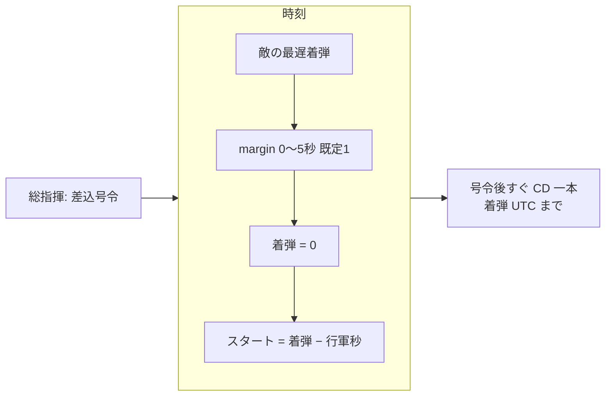
```mermaid
flowchart LR
    subgraph calc [時刻]
        E[敵の最遅着弾]
        M[margin 0〜5秒 既定1]
        Z[着弾 = 0]
        E --> M --> Z
        Z --> St[スタート = 着弾 − 行軍秒]
    end

    HQ2[総指揮: 差込号令] --> calc
    calc --> UI[号令後すぐ CD 一本\n着弾 UTC まで]
```

| 項目 | 仕様 |
|------|------|
| **利用者** | **占領同盟プレイヤーのみ**（攻撃側は表示しない） |
| ロジック | 敵最遅着弾 − margin ＝ 着弾(0)。**入替と同型** |
| 表示 | 号令後**即CD**、着弾まで**一本** |
| 号令確定 | `insert_fire_target`（参謀が差込号令を出したあと） |

---

### 4-3 占領入替（swap）— 占領同盟のみ

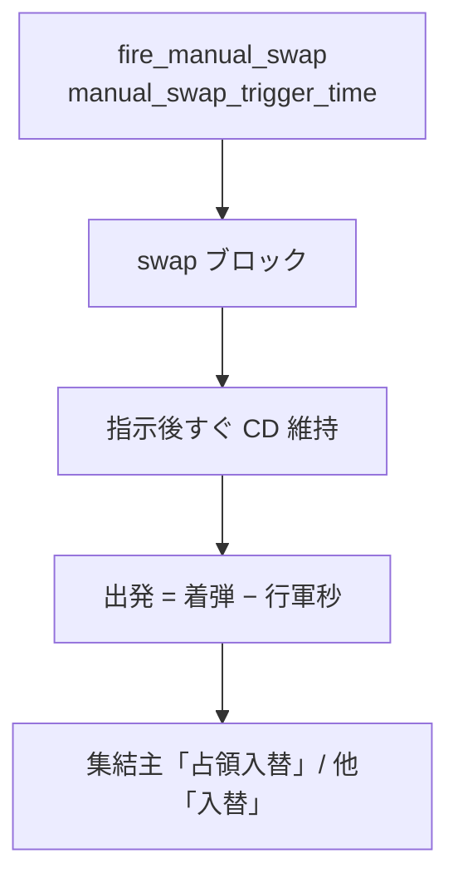
```mermaid
flowchart TD
    HQ[fire_manual_swap\nmanual_swap_trigger_time]
    HQ --> P[swap ブロック]
    P --> CD[指示後すぐ CD 維持]
    CD --> Dep[出発 = 着弾 − 行軍秒]
    Dep --> Lbl[集結主「占領入替」/ 他「入替」]
```

| 項目 | 仕様 |
|------|------|
| 表示 | 指示後もブロック維持（filter で常に残す） |
| 時刻 | `manual_swap_trigger_time` |

---

### 4-4 占領抜き（wd_manual）— 攻撃同盟のみ

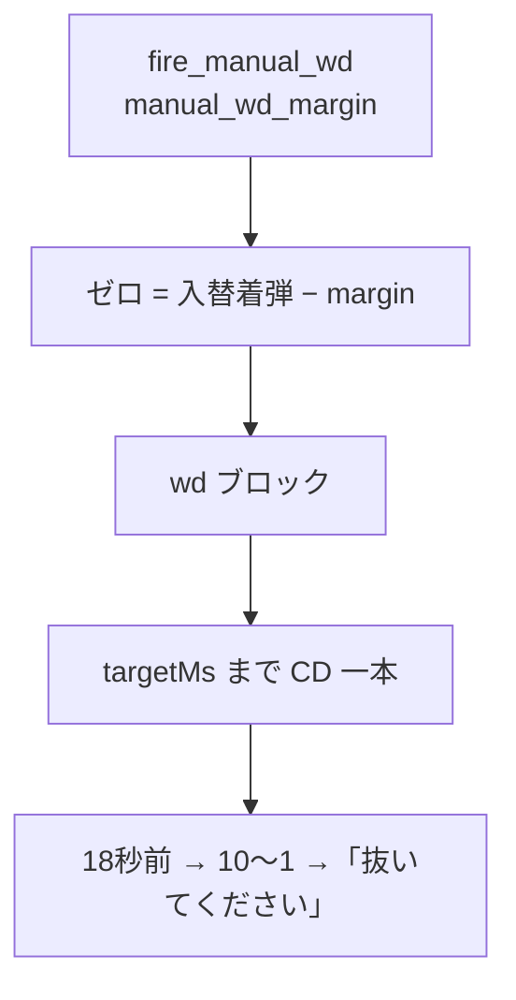
```mermaid
flowchart TD
    HQ[fire_manual_wd\nmanual_wd_margin]
    HQ --> Zero[ゼロ = 入替着弾 − margin]
    Zero --> P[wd ブロック]
    P --> CD[targetMs まで CD 一本]
    CD --> V[18秒前 → 10〜1 →「抜いてください」]
```

| 項目 | 仕様 |
|------|------|
| **利用者** | **攻撃同盟** |
| CD | **`targetMs - now` 一本**（指示後すぐ） |
| **禁止** | 10秒境界で0→再カウント、`wdDisplayPhase` 分岐 |

---

## 5. プレイヤー画面の構成

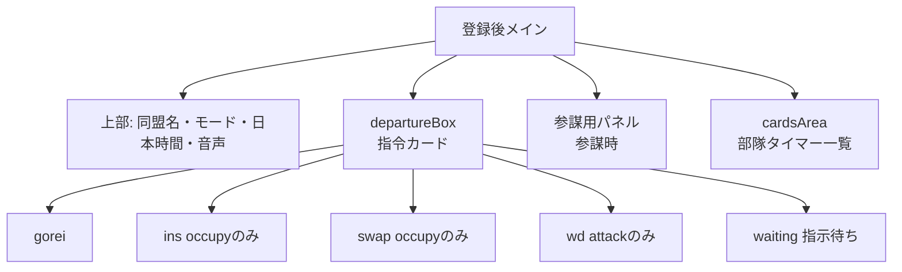
```mermaid
flowchart TB
    Main[登録後メイン]

    Main --> Top[上部: 同盟名・モード・日本時間・音声]
    Main --> Dep[departureBox\n指令カード]
    Main --> StaffP[参謀用パネル\n参謀時]
    Main --> Cards[cardsArea\n部隊タイマー一覧]

    Dep --> B1[gorei]
    Dep --> B2[ins occupyのみ]
    Dep --> B3[swap occupyのみ]
    Dep --> B4[wd attackのみ]
    Dep --> B0[waiting 指示待ち]
```

---

## 6. 役割 × モード × 見えるもの

| 役割 | 練習 | SVS | 主に見るブロック | 操作 |
|------|------|-----|------------------|------|
| **参謀** | 同ルーム必須 | 可 | 参謀パネル＋待機/号令 | 各集結主へ集結指示 |
| **集結主 第1班** | ○ | ○ | gorei 3段階（開始まで/集結中/行軍中） | 集結ボタンを押す側 |
| **集結主 第2班** | ○ | ○ | 同上 | 同上 |
| **乗り手** | ○ | ○ | 第1/第2班を別枠で監視（上から：乗り手／集結中／CD／集結主が集結中です。／着弾時間） | **集結はかけない**。着弾時刻を確認 |
| **占領同盟員** | — | occupy | ins + swap | CDに合わせる |
| **攻撃同盟員** | — | attack | wd_manual | 0秒で撤退 |

---

## 7. 号令音声（現状・2026-05）

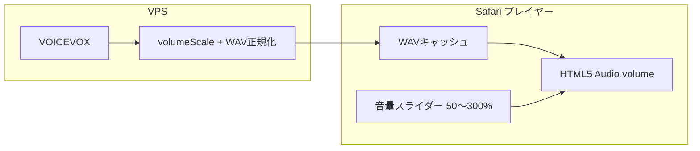
```mermaid
flowchart LR
    subgraph server [VPS]
        VV[VOICEVOX]
        Boost[volumeScale + WAV正規化]
        VV --> Boost
    end

    subgraph phone [Safari プレイヤー]
        Cache[WAVキャッシュ]
        Slider[音量スライダー 50〜300%]
        Play[HTML5 Audio.volume]
        Cache --> Play
        Slider --> Play
    end

    Boost --> Cache
```

- 準備完了表示: 「VOICEVOX音声の準備完了」
- 再生: Web Audio ではなく **HTML5 `<audio>`**（iPhone でスライダーが効く経路）
- **2device** のみ号令CD連動の自動音声。1台運用は表示・時計優先。

---

## 8. Agent への指示ルール（おさらい）

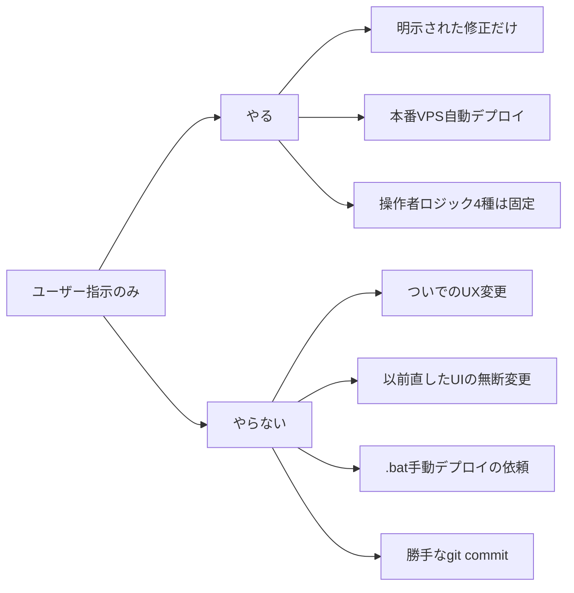
```mermaid
flowchart LR
    U[ユーザー指示のみ]
    U --> Do[やる]
    U --> Dont[やらない]

    Do --> D1[明示された修正だけ]
    Do --> D2[本番VPS自動デプロイ]
    Do --> D3[操作者ロジック4種は固定]

    Dont --> N1[ついでのUX変更]
    Dont --> N2[以前直したUIの無断変更]
    Dont --> N3[.bat手動デプロイの依頼]
    Dont --> N4[勝手なgit commit]
```

### チェックリスト（仕様理解の確認用）

1. **練習**はルーム単位、**SVS**は XYZ/MTC/APL の1同盟参加か
2. **差込・入替**は占領、**占領抜き**は攻撃か
3. **総指揮**は主に **SVS本番**向け、練習は **参謀パネル**中心か
4. **スマホ1台**では自動音声より **表示・時計**が主か
5. **wd** は10秒でCDを切り替えないか

---

## 9. 指示の書き方例（コピー用）

```text
【参照】docs/operation_spec_summary.md の「4-4 占領抜き」

【依頼】〇〇のみ修正してください。
【禁止】差込・入替・集結のロジック変更、UIレイアウトのついで変更、文言変更
【確認】本番 https://3301-svs.jp/ で 〇〇を確認
```

---

## 更新履歴

| 日付 | 変更概要 | 編集ファイル（コード） |
|------|----------|------------------------|
| 2026-05-20 | 初版作成（モード分岐・操作者4種・役割表・指示例） | — |
| 2026-05-20 | 号令音声: HTML5 Audio 経路・サーバー音量底上げ；仕様書の常時更新ルール追加 | `player.html`, `main.py`, `.cursor/rules/operation-spec-doc.mdc` |
| 2026-05-20 | 現状スナップショット・更新履歴セクション追加（ユーザー依頼） | `docs/operation_spec_summary.md`, `workflow-status.mdc` |
| 2026-05-20 | 集結号令: 乗り手「出発」廃止、全員「集結開始」 | `player.html`, `operator-logic-guard.mdc`, `operator_spec_guard.py` |
| 2026-05-20 | 集結号令: 集結主3段階CD・乗り手は各集結主監視のみ。禁止呼称ルール | `player.html`, `operator-logic-guard.mdc`, `operator_spec_guard.py` |
| 2026-05-20 | 乗り手ラベル整理・「発火」→「号令の出し方」等に改称 | `player.html`, `docs/operation_spec_summary.md` |
| 2026-05-20 | 乗り手文言をユーザー指定どおり簡素化 | `player.html` |
| 2026-05-21 | 参謀テーブル「出征開始まで」列追加・着弾時間列復元 | `player.html` |
| 2026-05-21 | §4-1 集結号令：1〜6枠・行軍max・start_at 逆算・役割別を追記 | `docs/operation_spec_summary.md` |
| 2026-05-21 | §4-1-G〜J：即時号令・着弾指定号令・解除・比較表 | `docs/operation_spec_summary.md` |
| 2026-05-21 | §4-1-K：号令時の集結時間（5分・モード共通・将来分離予定） | `docs/operation_spec_summary.md` |
| 2026-05-21 | 練習・参謀に集結1分/5分チェック、`set_default_rally` | `player.html`, `main.py`, `docs/operation_spec_summary.md` |
| 2026-05-20 | §2-1 訓練ルーム作成・参加・一覧・localStorage・WS 詳細 | `docs/operation_spec_summary.md` |
| 2026-05-20 | ルーム一覧: 取得時削除廃止・参加タブで list 再送 | `main.py`, `player.html`, `docs/operation_spec_summary.md` |
| 2026-05-20 | UI 仕様書 `ui_spec_summary.md` 初版・相互リンク | `docs/ui_spec_summary.md`, `docs/operation_spec_summary.md` |
| 2026-05-20 | `ui_spec_summary.md` §10 表示内容（CD・列・出し分け） | `docs/ui_spec_summary.md`, `docs/operation_spec_summary.md` |
| 2026-05-20 | `ui_spec_summary.md` §9 指示系 UI（待機・4種カード・1台/2台） | `docs/ui_spec_summary.md`, `docs/operation_spec_summary.md` |

---

*コード変更時は `operator-logic-guard` と QA `op_operator_mandatory_bundle` を優先。本ファイルは `operation-spec-doc.mdc` により修正ターンごとに同期する。*
