# 3301 操作仕様 — ビジュアル版（スクショ付き）

テキスト詳細版: [`operation_spec_summary.md`](operation_spec_summary.md)  
操作手順: [`user_manual.md`](user_manual.md)

---

## 0. 全体の入口

```
3301-svs.jp/
├── プレイヤー (player.html)  ← 同盟員・参謀
└── staff_hq_3301 (index.html) ← 総指揮（SVS専用）
```

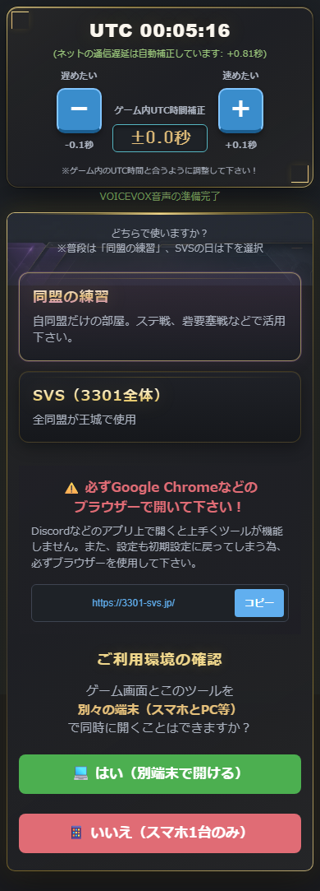

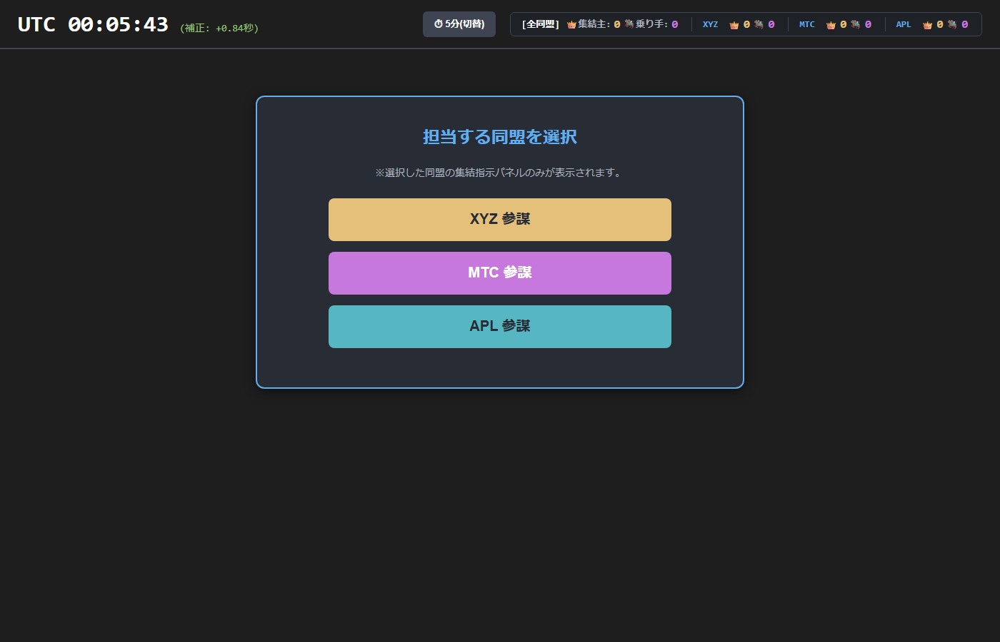

---

## 1. オンボーディング（共通フロー）

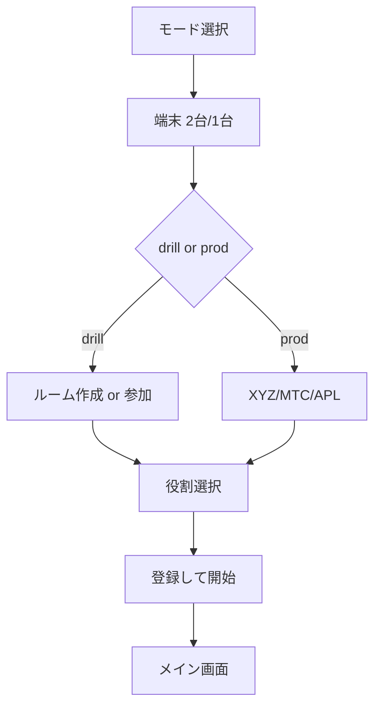

| ステップ | スクショ |
|----------|----------|
| モード | 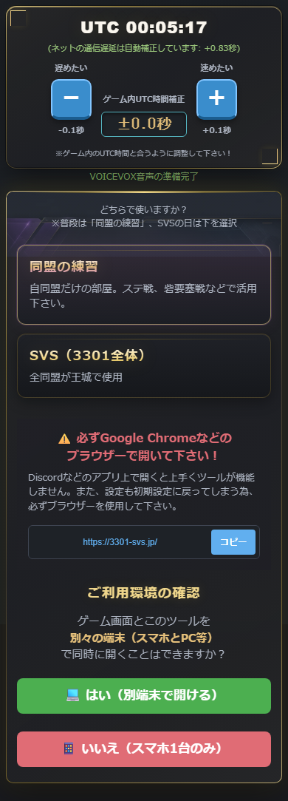 |
| 練習入口 |  |
| ルーム作成 | 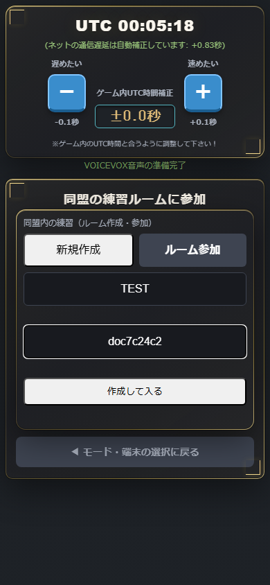 |
| 参加 | 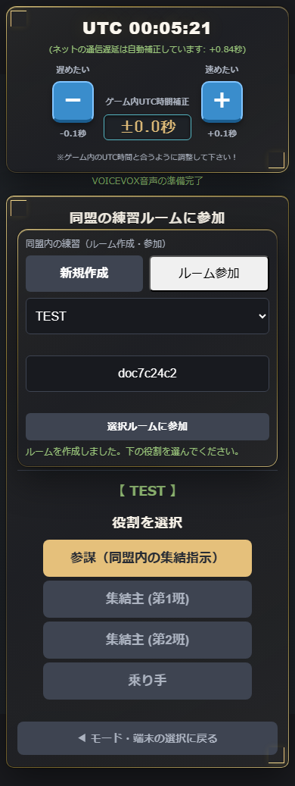 |
| SVS同盟 | 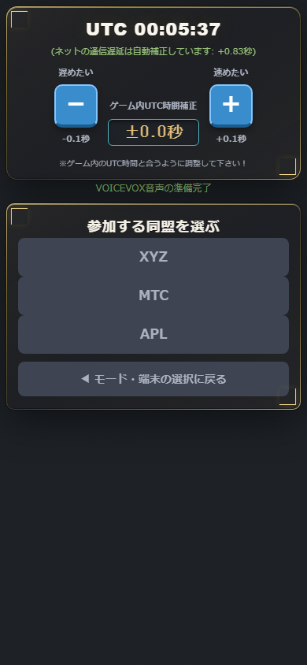 |

**端末**

| モード | 自動号令音声 |
|--------|--------------|
| 2device | 18秒前予告・10秒CD あり |
| 1device | なし（時計表示が主） |

---

## 2. 同盟の練習（drill）

### 2-1. 参謀：ルーム作成

1. 同盟名 + 参加コード → **作成して入る**
2. 成功メッセージ → 役割選択が下に展開


**WS:** `set_mode` + `room_action: create`

### 2-2. 参謀：登録

1. **参謀** → プレイヤー役割（班/乗り手）→ **参謀名** → 登録
2. `set_staff_mode` + `register_player` + `set_staff_name`

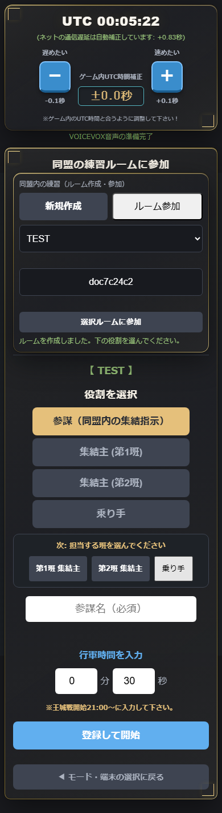

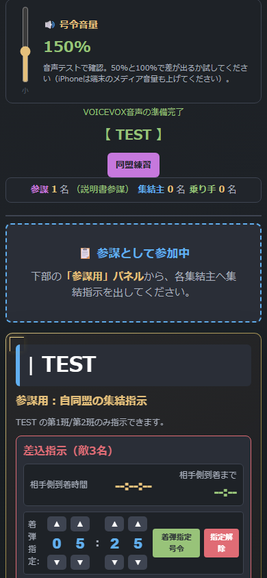

### 2-3. 参加者：参加

1. **参加** タブ → 同盟名選択（**TEST のみ**、人数・ID なし）
2. 参加コード入力 → **選択ルームに参加**
3. 役割選択 → **登録して開始**

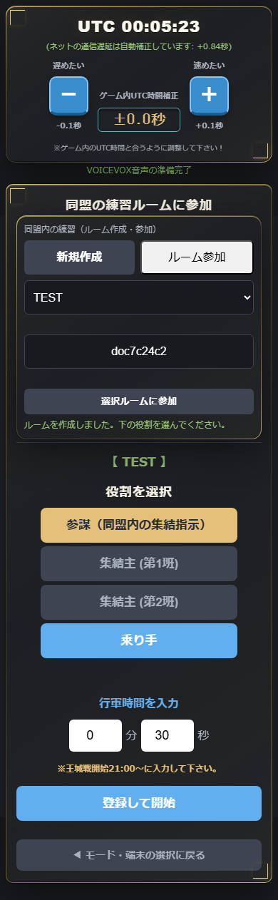

### 2-4. 参謀：集結指示

参謀用パネルから **集結開始** / 着弾 UTC 調整。


**WS:** `fire_gorei` / `mod_gorei_target` / `set_default_rally`

### 2-5. 参謀在室の判定

| 表示 | 条件 |
|------|------|
| 参謀 N名 | `staff_enabled` 接続が同盟に存在 |
| drill_staff.present | 同上（待機文案に使用） |
| 待機中… | present=true + staff_names[0] |


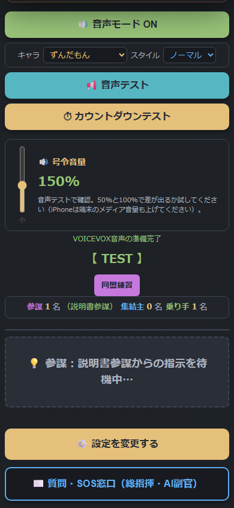

---

## 3. SVS（prod）

- プレイヤー: 同盟選択 → 役割登録 → 総指揮の指示を待つ
- 操作: **総指揮画面のみ**（3 同盟横断）


---

## 4. 操作者ロジック 4 種（固定）

テキスト・数式の正: [`operation_spec_summary.md`](operation_spec_summary.md) §4  
コード固定: `.cursor/rules/operator-logic-guard.mdc`

| 種別 | 誰が | プレイヤー画面 |
|------|------|----------------|
| **集結号令** gorei | 総指揮・参謀 | 集結中 CD + 着弾 UTC |
| **差込** ins | 占領同盟・総指揮 | スタート CD → 着弾 |
| **占領入替** swap | 総指揮 | 入替/占領入替 + 着弾 UTC |
| **占領抜き** wd_manual | 総指揮 | 指示後すぐ CD → ゼロまで一本 |

> 号令発火後の指令カードスクショは `capture_doc_screenshots.py` に `--with-gorei` 追加で拡張可能。

---

## 6. 役割 × モード × 見えるもの

| 役割 | drill | prod |
|------|-------|------|
| 参謀 | 参謀パネル + 待機表示 | —（総指揮画面） |
| 集結主 | 指令カード + 部隊カード | 同上 |
| 乗り手 | 指令カード（乗り手用表示） | 同上 |
| 総指揮 | — | index.html 全操作 |

---

## 更新履歴

| 日付 | 内容 |
|------|------|
| 2026-05-23 | 初版（操作フロー + 本番スクショ） |
