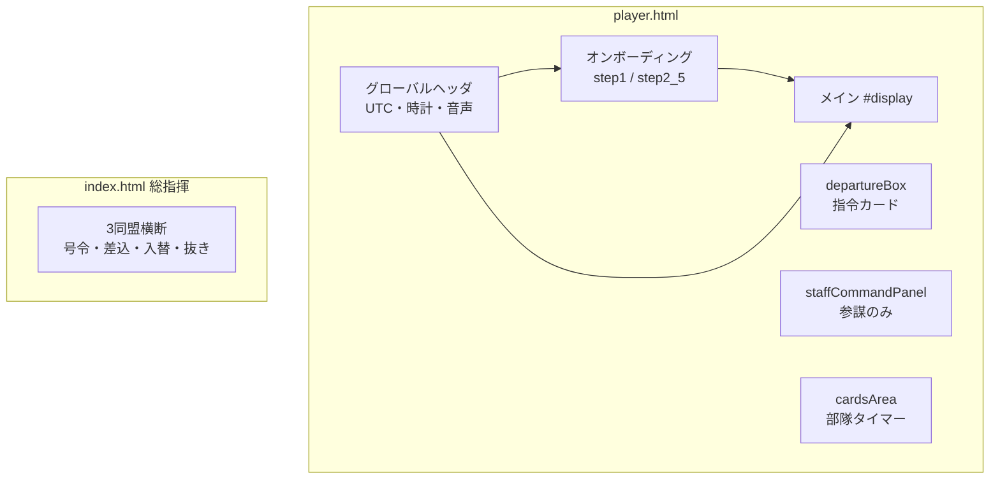
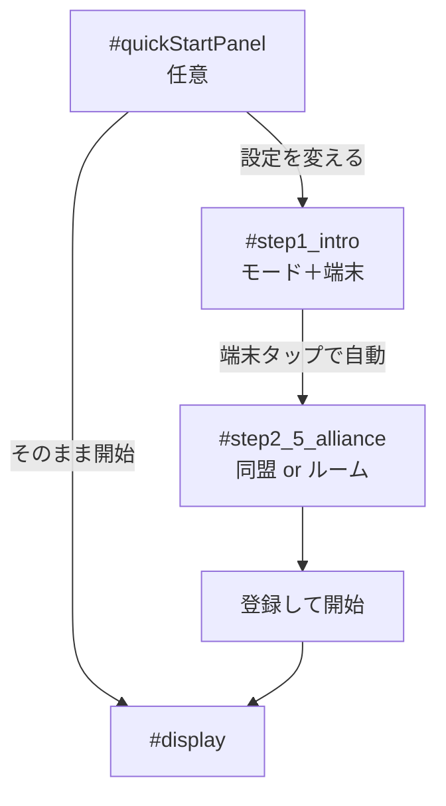
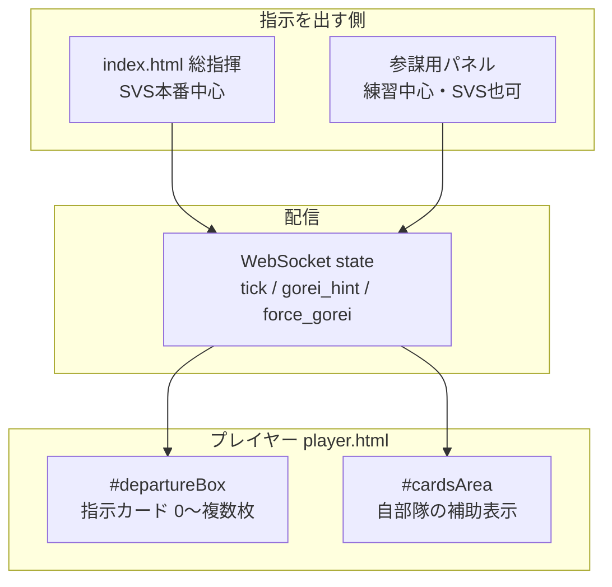
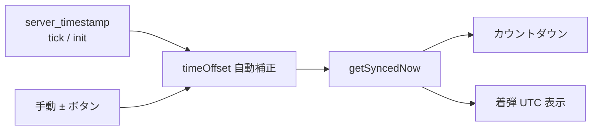

# 3301 UI 仕様まとめ（画面・レイアウト・表示内容）

本資料は次の **2層** をまとめた単一の正です。

| 層 | 章 | 内容 |
|----|-----|------|
| **UI シェル** | §0〜§8 | 画面構成・色・固定文言・ボタンラベル（**役割別縦構成 §3-0**） |
| **指示系 UI** | **§9** | プレイヤーが **総指揮・参謀の指示を受けたとき** に `#departureBox` に出る UI |
| **表示内容** | **§10** | 各項目の **動的データ**（数値・時刻の算出・形式） |

**時刻の計算式・WS コマンド**は [`operation_spec_summary.md`](operation_spec_summary.md)（§4 操作者ロジック、§4-1 集結号令）を参照。指示の見え方は **§9**、値の意味は **§10**。

**関連ドキュメント**

| 資料 | 内容 |
|------|------|
| [**user_manual.md**](user_manual.md) | **操作説明書（スクショ付き）** |
| [**ui_spec_visual.md**](ui_spec_visual.md) | **本資料のビジュアル版（スクショ付き）** |
| [`operation_spec_summary.md`](operation_spec_summary.md) | 操作・WS・モード分岐・集結号令の計算 |
| [`operation_spec_visual.md`](operation_spec_visual.md) | 操作仕様ビジュアル版 |
| [`design_onboarding.md`](design_onboarding.md) | オンボーディングの Figma 用ピクセル仕様（本資料 §2 と同期） |
| [screenshots/](screenshots/) | 本番スクショ PNG（`python scripts/capture_doc_screenshots.py` で再取得） |
| `.cursor/rules/ui-design.mdc` | UI 修正時のデザイン方針 |

**本番 URL**

| 画面 | URL | ファイル |
|------|-----|----------|
| プレイヤー | https://3301-svs.jp/ | `player.html` |
| 総指揮 | https://3301-svs.jp/staff_hq_3301 | `index.html` |

**維持ルール:** UI または固定文言を変えたターンでは、本ファイルと `operation_spec_summary.md` のスナップショットを更新する。

---

## 現状スナップショット

| 項目 | 現状（2026-05-20） |
|------|---------------------|
| **最終更新** | 2026-05-23 |
| **直近の変更** | ビジュアル版 [`ui_spec_visual.md`](ui_spec_visual.md)・操作説明書 [`user_manual.md`](user_manual.md) 追加 |
| **デザイン基準幅** | 390px（モバイル優先） |
| **禁止呼称** | 司令官 / 司令塔 / リーダー / 班長（UI に出さない） |
| **正式呼称** | 総指揮 / 参謀 / 集結主 / 乗り手 / 第1班・第2班 |

---

## 0. 画面一覧

> **スクショ:** [ui_spec_visual.md §0](ui_spec_visual.md#0-画面一覧) — `docs/screenshots/01_entry_mode.png` ほか



| 画面 | 表示条件 | 主な DOM |
|------|----------|----------|
| クイック再開 | 前回設定あり・入口表示中 | `#quickStartPanel` |
| 入口 | 初回・設定変更 | `#step1_intro` |
| 参加 | 端末選択後 | `#step2_5_alliance` |
| メイン | 登録後 | `#display` |
| 参謀パネル | 参謀登録後 | `#staffCommandPanel` |
| サポート | オーバーレイ | `#chatOverlay` |

総指揮画面（`index.html`）のレイアウト詳細は本資料 **§6**（概要のみ）。操作仕様は `operation_spec_summary.md` §3。

---

## 1. デザインシステム（共通）

### 1-1. カラートークン

| トークン | 値 | 用途 |
|--------|-----|------|
| アプリ背景 | `#1a1b1f` / `#1E1E1E` | `body` |
| カード面 | `#282C34` → `var(--utc-panel)` | `.card` |
| インセット面 | `#1E2227` | 入力・着弾枠・参謀差込 |
| 枠線 | `#3E4451` | 一般 border |
| 本文 | `#D7DEE9` / `#ABB2BF` | 見出し / 補足 |
| アクセント青 | `#61AFEF` | リンク・選択・第2班シアン系 |
| ゴールド | `#E5C07B` / `var(--gold-mid)` | SVS・参謀・CD 強調 |
| 練習紫 | `#C678DD` | モードバッジ・第1班 |
| 成功緑 | `#98C379` | 着弾 UTC・占領・ボタン成功 |
| 警告赤 | `#E06C75` | エラー・1台端末・解除 |
| 第2班シアン | `#56B6C2` | 第2班枠・即時号令ボタン |

### 1-2. 装飾（プレイヤー）

- **金のグラデーション枠:** `.card`, `.utc-main-wrapper`, `.lux-instruction-frame` 等（`--lux-border`）
- **四隅飾り:** `.card::before/::after`（入口カード `#step1_intro` は除く）
- **数値フォント:** `Arial Black` / `Verdana`（CD・着弾時刻）
- **タップ最小高さ:** 48px 目安（`.env-btn`, タブ, 同盟行）

### 1-3. モードバッジ（メイン上部）

| モード | `#modeBadge` 文言 | 背景 | 文字 |
|--------|-------------------|------|------|
| drill | **同盟練習** | `#C678DD` | `#1E2227` |
| prod | **SVS** | `#3E4451` | `#ABB2BF` |

### 1-4. 配置図

| モード | `#btnLayoutMap` |
|--------|-----------------|
| drill | **非表示** |
| prod | 表示「🗺️ 今回の配置図」 |

---

## 2. オンボーディング UI

詳細ピクセル値は [`design_onboarding.md`](design_onboarding.md)。ここでは **画面 ID・文言・表示条件** を固定する。

### 2-1. フロー



### 2-2. クイック再開（`#quickStartPanel`）

| 要素 | 文言・仕様 |
|------|------------|
| タイトル | **おかえりなさい**（15px `#98C379`） |
| サマリー | `#quickStartSummary` — 例: `前回: 同盟の練習 / 別端末 / TEST / 参謀` |
| 主ボタン | **そのまま開始** |
| 副ボタン | **設定を変える** |

### 2-3. 入口（`#step1_intro`）

| ブロック | 要素 | 固定文言 |
|----------|------|----------|
| モード | `#btnModeDrill` | タイトル **同盟の練習** / 説明「自同盟だけの部屋。ステ戦、砦要塞戦などで活用下さい。」 |
| モード | `#btnModeProd` | **SVS（3301全体）** / 「全同盟が王城で使用」 |
| ヒント | カード上 | 「どちらで使いますか？」「※普段は「同盟の練習」、SVSの日は下を選択」 |
| 端末 | `#btnEnv2device` | **💻 はい（別端末で開ける）** |
| 端末 | `#btnEnv1device` | **📱 いいえ（スマホ1台のみ）** |
| 見出し | h2 | **ご利用環境の確認** |

**挙動:** 端末ボタンタップで `#step2_5_alliance` へ自動遷移（「次へ」なし）。

### 2-4. 参加（`#step2_5_alliance`）

| 要素 | drill | prod |
|------|-------|------|
| `#allianceStepTitle` | **同盟の練習ルームに参加** | **参加する同盟を選ぶ** |
| 同盟選択 | `#drillConfigArea` 表示 | `#prodAlliancePick`（XYZ / MTC / APL） |
| 1台バナー | `#oneDeviceClockBanner` 表示時文案 | 同左 |
| 戻る | **◀ モード・端末の選択に戻る** | 同左 |

#### 練習ルーム（`#drillConfigArea`）

| 要素 | 文言 |
|------|------|
| ラベル | **同盟内の練習（ルーム作成・参加）** |
| タブ | **新規作成** / **ルーム参加** |
| 入力 | placeholder **同盟名（例: MTC練習）** |
| 入力 | placeholder **参加コード（同盟内共有）** |
| 作成ボタン | **作成して入る** |
| 参加 | `#drillRoomSelect` 先頭 **ルームを選択**、以降 **同盟名のみ**（例: `TEST`） |
| 参加コード | placeholder **参加コード（参謀から共有）** |
| 参加ボタン | **選択ルームに参加** |
| 状態 | `#drillStatusMsg`（送信中・成功・エラー） |

**一覧再取得:** 「ルーム参加」タブ表示時・参加画面表示時・参加失敗時にサーバーへ list を再送（操作仕様 §2-1）。

#### 役割（`#roleSetupSection`）

| ボタン | ID | 文言 |
|--------|-----|------|
| 参謀 | `#btnStaff` | **参謀（同盟内の集結指示）** |
| 集結主1 | `#btnLeader1` | **集結主 (第1班)** |
| 集結主2 | `#btnLeader2` | **集結主 (第2班)** |
| 乗り手 | `#btnRider` | **乗り手** |
| 参謀班選択 | `#staffPlayerRoleArea` | **第1班 集結主** / **第2班 集結主** / **乗り手** |
| 参謀ヒント | `#staffRoleHint` | **次: 担当する班を選んでください** |
| CTA | — | **登録して開始** |
| 設定変更 | `#display` 内 | **⚙️ 設定を変更する** → 参加画面へ戻る |

---

## 3. メイン画面（`#display`）

登録後、`#display` 内は **上から下** に次の DOM が並ぶ（`player.html` 実装順）。

```text
┌─ #display（メイン）────────────────────────────────────────────┐
│  ヘッダ … #displayAllianceName / #modeBadge / 配置図ボタン      │
├───────────────────────────────────────────────────────────────┤
│  #departureBox     … 指示を「受ける」領域（§9・§10-3）         │
├───────────────────────────────────────────────────────────────┤
│  #staffCommandPanel … 参謀のみ・指示を「出す」領域（§4）       │
├───────────────────────────────────────────────────────────────┤
│  #cardsArea        … 部隊タイマー一覧（§5・§10-5）             │
├───────────────────────────────────────────────────────────────┤
│  ⚙️ 設定を変更する / ✉️ サポート窓口（§3-4）                    │
└───────────────────────────────────────────────────────────────┘
```

**役割ごとに見えるブロック**（同一画面でも **上2段** と **下1段** の役割が違う）。

| 役割 | `#departureBox` | `#staffCommandPanel` | `#cardsArea` |
|------|-----------------|----------------------|--------------|
| **集結主** | §9-2 待機 or §9-4 指令カード | **非表示** | §5 自部隊カード **1枚** |
| **参謀** | §9-2 参謀待機 or （兼任時）§9-4 | **§4 全文**（操作の主画面） | 通常 **空**（表は参謀パネル内） |
| **乗り手** | §9-2 待機 or §9-5 監視カード最大2枚 | **非表示** | §5 名前あり部隊 **複数枚** |

詳細ワイヤーは **§3-0-1〜3**、指令カードの中身は **§9**、部隊カードの中身は **§5**。

### 3-0-1. 集結主の画面構成

集結主は **上部＝号令の指示**、**下部＝自分の部隊タイマー** の **2ブロック** で見る。

```text
┌ #departureBox ────────────────────────────────────────────────┐
│  💡 参謀：{名前}からの指示を待機中…                             │
│     or                                                         │
│  【§9-4】player-action-card（金枠・指令カード）                  │
│   ⏳ 集結開始まで / 集結中 / 行軍中  …  ✅ … 完了               │
│   {CD} M:SS                                                    │
│   ┌ lux-arr-panel ──────────────────────────────────────────┐  │
│   │ 🎯 着弾時間 (UTC)   HH:MM:SS                            │  │
│   └─────────────────────────────────────────────────────────┘  │
└────────────────────────────────────────────────────────────────┘

┌ #cardsArea ───────────────────────────────────────────────────┐
│  【§5】部隊カード `.card`（自分の名前の行のみ・最大1枚）         │
│   [第1班] または [第2班]                                        │
│   {名前}部隊                                                    │
│   {状態} … 待機中 / 集結ボタンまで / 集結中 / 行軍中             │
│   {CD} M:SS                                                    │
│   ┌ 着弾枠 #1E2227 ─────────────────────────────────────────┐ │
│   │ 🎯 着弾時間 (UTC)   --:--:--  or  HH:MM:SS               │ │
│   └──────────────────────────────────────────────────────────┘ │
└────────────────────────────────────────────────────────────────┘
```

| ブロック | 用途 | 仕様章 |
|----------|------|--------|
| 上 `#departureBox` | 参謀・総指揮からの **号令**（いつ集結開始か・班着弾 UTC） | **§9-4** |
| 下 `#cardsArea` | **自分の部隊行**のタイマー（ゲーム操作と照合） | **§5** |

**見分け:** 上は **⏳／✅ + 金枠 `player-action-card`**。下は **班バッジ + ○○部隊 + 状態文言「待機中」等**（指令カードとは別クラス `.card`）。

### 3-0-2. 参謀の画面構成

参謀は **操作は下部パネル**、**上部は待機案内または（号令中）自班の進行確認**。

```text
┌ #departureBox ────────────────────────────────────────────────┐
│  📋 参謀として参加中                                            │
│  下部の「参謀用」パネルから、各集結主へ集結指示を出してください。  │
│     or（号令後・自班タイマー反映時）                             │
│  【§9-4 と同型】自班の gorei 指令カード（進行確認用）            │
└────────────────────────────────────────────────────────────────┘

┌ #staffCommandPanel（参謀用・常時表示）──────────────────────────┐
│  同盟名 + 参謀用：自同盟の集結指示                               │
│  {同盟名} の第1班/第2班のみ指示できます。                         │
├─ §4-2 差込パネル #staffInsertPanel（任意表示）──────────────────┤
├─ §4-3 第1班ブロック #staffCommandCards ─────────────────────────┤
│   猶予+ / 即時号令 / 着弾指定 / 1分・5分 / メンバー表 …          │
├─ 第2班ブロック（同上）─────────────────────────────────────────┤
└────────────────────────────────────────────────────────────────┘

┌ #cardsArea ───────────────────────────────────────────────────┐
│  （通常は空。集結主・乗り手向けの部隊カードは出さない）           │
└────────────────────────────────────────────────────────────────┘
```

| ブロック | 用途 | 仕様章 |
|----------|------|--------|
| 上 `#departureBox` | 参謀 **待機** または 号令後の **自班 gorei 確認** | §9-2 / §9-4 |
| 中 `#staffCommandPanel` | **号令を出す** UI（主操作面） | **§4** |
| 下 `#cardsArea` | 使わない（監視はパネル内メンバー表） | §10-4 |

**参謀＋集結主兼任**（登録時に第1班/第2班 集結主を選択）: 上に **§9-4**、中に **§4**、下に **§5 自部隊カード1枚** が同時に出る。

### 3-0-3. 乗り手の画面構成

乗り手は **上部＝班ごとの監視カード**、**下部＝部隊一覧**（名前が入っている行）。

```text
┌ #departureBox ────────────────────────────────────────────────┐
│  💡 参謀：{名前}からの指示を待機中…  （号令前）                  │
│     or                                                         │
│  【§9-5】gorei_rider_watch × 最大2（第1班・第2班）              │
│   乗り手                                                        │
│   集結準備中 / 集結中 / 行軍中                                   │
│   CD  {M:SS}                                                   │
│   集結主が集結準備中です。 等                                     │
│   🎯 着弾時間   HH:MM:SS                                       │
└────────────────────────────────────────────────────────────────┘

┌ #cardsArea ───────────────────────────────────────────────────┐
│  【§5】部隊カード × N（名前ありの行だけ・自同盟）                │
│   [第1班] a部隊  待機中  00:00  🎯 --:--:--                     │
│   [第1班] b部隊  集結中  1:23   🎯 21:05:00                    │
│   …                                                            │
└────────────────────────────────────────────────────────────────┘
```

| ブロック | 用途 | 仕様章 |
|----------|------|--------|
| 上 `#departureBox` | 第1班・第2班の **集結進行を監視**（自分は集結ボタンを押さない） | **§9-5** |
| 下 `#cardsArea` | 各部隊の **個別タイマー** 一覧 | **§5** |

**禁止（乗り手）:** §9-5 の **※ フッター注釈**、号令音声、旧ラベル「出発」。

### 3-1. 上部ヘッダ

| 要素 | 内容 |
|------|------|
| `#displayAllianceName` | **【 同盟名 】**（drill は作成同盟名） |
| `#modeBadge` | §1-3 |
| 地図 | §1-4 |

### 3-2. グローバル（登録前後共通）

| 領域 | ID | 内容 |
|------|-----|------|
| UTC | `#utc` | `UTC HH:MM:SS` |
| 遅延表示 | `#offsetDisp` | 通信遅延補正の説明 |
| 手動補正 | `#manualOffsetDisp` | ±秒（集結主向け） |
| 2台警告 | `#multiDeviceWarning` | 2台運用時の注意 |
| 音声行 | `#audioControlsArea` | 音声 ON/OFF・話者・スタイル・テスト |
| 音量 | `#voiceVolumePanel` | 縦スライダ 50〜300% |
| VOICEVOX | `#voiceReadyStatus` | **VOICEVOX音声の準備完了** 等 |
| 時計 | `#clockContainer` | アナログ + `#jstClock` 日本時間 |

**1台 (`1device`):** 指令カード内にアナログ時計 + 「お手元の時計がこの時間になったらボタンを押す！」

**2台 (`2device`):** 号令 CD 連動の自動音声（10秒カウント等）。

### 3-3. 指令エリア（`#departureBox`）

**プレイヤーが指示を受けて見る領域**（参謀本人が出す操作は下部 `#staffCommandPanel`）。  
カード組立・待機・種別ごとの見え方 → **§9 全体**。数値の意味 → **§10-3**。

#### 待機（指令なし）

| 条件 | 表示 |
|------|------|
| drill・参謀 | 📋 **参謀として参加中** — 下部 **参謀用** パネルから指示 |
| drill・参謀あり | **参謀：{名前}からの指示を待機中…** |
| drill・参謀なし | **参謀がルーム内にいません。** + 参加・参謀登録の案内 |
| prod 等 | 従来の待機文案（操作仕様参照） |

#### 集結号令 — 集結主（`type: gorei`）

| フェーズ | 見出し（`actionLabel`） | 着弾ラベル |
|----------|-------------------------|------------|
| pre_rally | **集結開始まで** | **着弾** |
| rallying | **集結中** | 着弾 |
| marching | **行軍中** | 着弾 |

- 枠色: `#E5C07B`
- CD: 大きな数字（2台 76px / 1台 56px）
- 着弾: `HH:MM:SS` UTC（`#arr_*`）

#### 集結号令 — 乗り手（`type: gorei_rider_watch`）

**上から順（固定）:**

| 順 | 要素 | 文言 |
|----|------|------|
| 1 | 役割タグ | **乗り手** |
| 2 | 見出し | **集結準備中** / **集結中** / **行軍中** |
| 3 | CD キャプション | **CD** |
| 4 | CD 数字 | カウント |
| 5 | サブ行 | **集結主が集結準備中です。** 等 |
| 6 | 着弾 | ラベル **着弾時間** + UTC |

※ **※** フッター注釈は出さない（廃止済み）。

#### 差込（`type: ins`）— 占領同盟のみ

| 項目 | 文言 |
|------|------|
| actionLabel | **差込スタート** |
| arrLabel | （着弾 UTC パネル） |

#### 占領入替（`type: swap`）— 占領のみ

| 役割 | actionLabel |
|------|-------------|
| 集結主 | **占領入替** |
| その他 | **入替** |

#### 占領抜き（`type: wd_manual`）— 攻撃のみ

| 項目 | 文言 |
|------|------|
| actionLabel | **占領抜き (一斉撤退)** |
| arrLabel | **撤退完了** |
| 色 | `#C678DD` |

### 3-4. 下部アクション

| ボタン | 文言 |
|--------|------|
| 設定 | **⚙️ 設定を変更する** |
| サポート | **✉️ 質問・SOS窓口（総指揮・AI副官）** |

---

## 4. 参謀用パネル（`#staffCommandPanel`）

**表示:** `isStaffCommander === true` のときのみ。

### 4-1. ヘッダ

| 要素 | 内容 |
|------|------|
| `#staffAllianceHead` | 縦線 + **同盟名**（大）+ drill 時は占領/攻撃バッジなし |
| タイトル行 | **参謀用：自同盟の集結指示** |
| `#staffCommandLabel` | `{同盟名} の第1班/第2班のみ指示できます。` |

### 4-2. 差込（`#staffInsertPanel`）— 練習でも表示可

| 項目 | UI |
|------|-----|
| 見出し | **差込指示（敵3名）**（赤系） |
| 列 | 相手側到着時間 / 相手側到着まで |
| 操作 | 着弾指定 ▲▼、**着弾指定号令** / **指定解除** |
| 下部 | **最終着弾の [▲▼] 秒前に差込着弾 (0~5)** |

### 4-3. 第1班 / 第2班カード（`#staffCommandCards`）

各班 1 ブロック。枠色: 第1班 `#C678DD` / 第2班 `#56B6C2`。

```text
┌─ 第1班 / 第2班 タブ風タイトル ─────────────────────┐
│ 猶予+ [▲][十位][▼] [▲][一桁][▼] 秒    [即時号令（今のタイミング）] │
├─ 着弾指定枠（#1E2227）──────────────────────────────┤
│ 着弾: [mm][mm]:[ss][ss]  [集結時間 ☑1分 ☑5分]※drill第1班のみ │
│                    [着弾指定号令] [解除]              │
├─ メンバー表 ─────────────────────────────────────────┤
│      出征開始まで | 集結時間 | 行軍時間 | 着弾時間▶   │
│ ● 名前  --:--      1:00      0:30      ▶--:--        │
└────────────────────────────────────────────────────┘
```

| コントロール | 文言 | 備考 |
|--------------|------|------|
| 猶予 | **猶予+** … **秒** | 黄数字 `#E5C07B` |
| 即時 | **即時号令（今のタイミング）** | 班色ボタン |
| 着弾 | **着弾:** | mm:ss 各桁 ▲▼ |
| 集結時間 | **集結時間** + **1分** / **5分** | **drill・第1班のみ**、排他ラジオ風 |
| 号令 | **着弾指定号令**（緑）/ **解除**（赤） |
| 表頭 | **出征開始まで** / **集結時間** / **行軍時間** / **着弾時間** |

**各行・各列の値の意味** → **§10-4**。

**色:**

| 班 | ボーダー | 即時ボタンクラス |
|----|----------|------------------|
| 第1班 | `#C678DD` | `staff-btn-purple` |
| 第2班 | `#56B6C2` | `staff-btn-cyan` |

---

## 5. 部隊カード（`#cardsArea`）

登録後、自同盟タイマー一覧（50ms ごと更新）。画面上の位置は **§3-0**（集結主・乗り手はここが主な補助表示）。  
**表示する項目の算出** → **§10-5**。

### 5-1. 部隊カード共通ワイヤー（`.card`）

`#departureBox` の **指令カード**（`player-action-card`）とは **別コンポーネント**。金枠の `lux-instruction-frame` は付かない。

```text
┌─ .card（部隊カード・#cardsArea 内）────────────────────────────┐
│  [第1班] または [第2班]   ← .squad-badge（紫 / シアン）         │
│  {名前}部隊                 ← h2・#61AFEF                       │
│  {状態文言}                 ← 18px・太字                        │
│                    {CD}     ← .countdown・M:SS                 │
│  ┌ 着弾枠（#1E2227・border #3E4451）─────────────────────────┐ │
│  │ 🎯 着弾時間 (UTC)                                        │ │
│  │              HH:MM:SS  or  --:--:--                      │ │
│  └──────────────────────────────────────────────────────────┘ │
└────────────────────────────────────────────────────────────────┘
```

| 状態文言（`t.state`） | 意味 |
|----------------------|------|
| **待機中** | `0` — 号令前・未アクティブ |
| **集結ボタンまで** | `4` — 集結開始 `start_at` まで |
| **集結中** | `1` — 集結 `end` まで |
| **行軍中** | `2` — 行軍 `end` まで |

### 5-2. 役割ごとの表示枚数

| 役割 | `#cardsArea` に出る行 |
|------|------------------------|
| **集結主** | **自分の名前**と一致する1行のみ |
| **乗り手** | 名前が **空でない** 行（自同盟・最大12） |
| **参謀** | 通常 **なし**（パネル内メンバー表で代替） |

---

## 6. 総指揮画面（`index.html`）— UI 概要

| 項目 | 仕様 |
|------|------|
| 利用者 | 総指揮 PC（本番 SVS 想定） |
| 範囲 | 3 同盟 × 小隊、敵 6 枠 |
| 操作 UI | 参謀パネルに相当する号令・差込・入替・抜きを **横断操作** |
| プレイヤーとの関係 | プレイヤー `departureBox` に同種ブロックが降りる |

詳細 DOM は `index.html` 参照。Figma / ピクセル指定は未分離（必要なら別途 `design_hq.md` を追加）。

---

## 7. サポートチャット（`#chatOverlay`）

| 要素 | 文言 |
|------|------|
| ヘッダ | **✉️ サポートセンター** |
| 閉じる | **✖** |
| 説明 | 本ツールのサポートチャット… AI副官… 画像は **🖼** … |
| 注意 | 個人開発のため返信に時間…（赤） |

---

## 8. モード別 UI 差分一覧

| 項目 | drill（同盟の練習） | prod（SVS） |
|------|---------------------|-------------|
| 同盟選択 | ルーム作成/参加 | XYZ / MTC / APL |
| モードバッジ | 同盟練習 | SVS |
| 配置図 | 非表示 | 表示可 |
| 参謀集結 1分/5分 | 第1班着弾枠内 | なし（5分既定） |
| 差込・入替・抜き | 参謀パネル中心 | + 総指揮 + 同盟役割で表示 |
| 待機文案 | 参謀在席必須 | 総指揮号令待ち |

---

## 9. プレイヤー指示系 UI（総指揮・参謀からの指示）

プレイヤー（集結主・乗り手・占領・攻撃）が **指示を受けたあと** に画面上部 `#departureBox` に表示される UI の仕様。  
参謀が操作する **参謀用パネル**（`#staffCommandPanel`）は **§4**（指示を**出す**側）。本節は指示を**受ける**側。



### 9-1. 指示の種類と「誰が出すか」

| 指示 `type` | プレイヤーに見える名前 | 主な発火元（練習 drill） | 主な発火元（SVS prod） | 見える同盟・役割 |
|-------------|------------------------|-------------------------|-------------------------|------------------|
| `gorei` | 集結号令（3段階） | **参謀**（第1班/第2班） | **総指揮** または **参謀** | 集結主・乗り手（班ごと） |
| `gorei_rider_watch` | 乗り手用監視カード | 同上（参謀の集結号令） | 同上 | **乗り手のみ** |
| `ins` | 差込 | 参謀（差込パネル）※練習でも可 | **総指揮** | **占領同盟のみ** |
| `swap` | 占領入替 / 入替 | 通常は総指揮のみ | **総指揮** | **占領同盟** |
| `wd_manual` | 占領抜き | 通常は総指揮のみ | **総指揮** | **攻撃同盟** |
| （なし） | 待機文案 | — | — | 全員 |

**練習の前提:** 集結号令は **参謀が同ルームにいて** パネルから出す。参謀不在時は **待機のみ**（指令カードは出ない）。  
**SVS の前提:** 総指揮が `index.html` から全同盟に指示。プレイヤーは **💡 総指揮からの指示を待機中...** から各カードへ遷移。

### 9-2. 待機 UI（指示がまだ無いとき）

`displayBlocks` が空のとき、`#departureBox` は **1枚の案内カード**（指令カードではない）。

| 条件 | 枠線色 | 表示 |
|------|--------|------|
| drill・**参謀本人** | 青破線 `#61AFEF` | 📋 **参謀として参加中** — 下部 **参謀用** パネルから指示 |
| drill・参謀在席・参加者 | 灰破線 `#3E4451` | 💡 **参謀：{名前}からの指示を待機中…** |
| drill・参謀不在 | 赤破線 `#E06C75` | **参謀がルーム内にいません。** ＋ 参加・参謀登録の案内文 |
| prod・全員 | 灰破線 `#3E4451` | 💡 **総指揮からの指示を待機中...** |

### 9-3. 指示カード共通レイアウト（`lux-instruction-frame`）

指示あり時は **種別ごとに1枚**（乗り手は班ごと最大2枚）。複数あるときは **`actionMs` の早い順** に縦積み。

#### 2台端末（`2device`）— 標準

```text
┌─ player-action-card（金枠・type別の色 border 2px）────────┐
│ ⏳ {指示名} まで          ← または ✅ … 完了               │
│                                                          │
│              {CD}  M:SS   ← 大きい数字 76px級            │
│                                                          │
│ ┌─ lux-arr-panel ─────────────────────────────────────┐ │
│ │ 🎯 {着弾ラベル}時間 (UTC)  または 着弾時間（乗り手）   │ │
│ │           HH:MM:SS                                    │ │
│ └───────────────────────────────────────────────────────┘ │
└──────────────────────────────────────────────────────────┘
```

#### 1台端末（`1device`）— 集結主・差込・入替・抜き

上部に **日本時間の目安**（アナログ時計 + `HH:MM:SS`）、その下に CD・着弾 UTC。

```text
┌─ 集結のタイミング (日本時間) または 出発時刻 ─────────────┐
│   (アナログ時計)     HH:MM:SS  ← actionMs + 9h           │
│   ※お手元の時計がこの時間になったらボタンを押す！         │
├─ 破線 ───────────────────────────────────────────────────┤
│ ⏳ 集結開始まで                                          │
│        {CD}                                              │
│ 着弾 HH:MM:SS UTC                                        │
└──────────────────────────────────────────────────────────┘
```

乗り手監視カード（`1device`）は **時計ブロックなし**（§9-5）。

#### 完了・非アクティブ時の見た目

| 状態 | 背景 | 枠・文字色 |
|------|------|------------|
| 進行中 | `#2A2E37` | 種別色（金・緑・赤・紫） |
| 完了（`actionMs` 経過等） | `#3E4451` | 灰 `#ABB2BF` |
| 見出し | — | 先頭に **✅** +「… 完了」 |

**維持:** 集結・入替・差込・抜きは **指示後もカードを残す**（着弾 UTC が見える）。フィルタで `ins/swap/wd/gorei` は着弾後もしばらく表示（`operator-logic-guard`）。

### 9-4. 集結号令 — 集結主向け（`type: gorei`）

**指示元:** 参謀の「即時号令」または「着弾指定号令」（練習）、総指揮の班号令（SVS）。  
**枠色:** `#E5C07B`（金）。**2device** 時のカード構造は §9-3 と同型（下記は段階ごとに中身を固定）。

**2device 音声:** **段階1（準備）** のみ 18秒前予告 → 10〜1 → **スタート**。集結中・行軍中は自動カウント音声なし。  
**参謀が号令した直後・タイマー未反映:** `gorei_hint` / `gorei_last_target` から **段階1と同型のプレビュー**を先に表示可。

---

#### 段階 1 — 準備（`goreiPhase: pre_rally` / タイマー `state: 4`）

**プレイヤーがすること:** 手元時計で **集結開始** のタイミングまで待つ（ゲーム内でまだ集結しない）。

```text
┌─ player-action-card（枠 #E5C07B 金・border 2px）────────────────┐
│ ⏳ 集結開始まで                    ← goreiPhase=pre_rally 進行中 │
│                                                                 │
│                    4:32                                         │
│              （CD・76px級・M:SS）  ← start_at までの残り秒        │
│                                                                 │
│ ┌─ lux-arr-panel ────────────────────────────────────────────┐ │
│ │ 🎯 着弾時間 (UTC)                                          │ │
│ │              21:05:00                                      │ │
│ │  ※ 班全員同じ T_sync（全員同じ班着弾）                      │ │
│ └────────────────────────────────────────────────────────────┘ │
└─────────────────────────────────────────────────────────────────┘
```

| 項目 | 値の意味 |
|------|----------|
| 見出し `⏳ 集結開始まで` | `actionLabel`（完了時は `✅ 集結開始まで 完了`） |
| **CD** | `goreiCdSeconds` → **`start_at` まで** |
| **着弾 UTC** | `targetMs` ＝ 班の着弾 `T_sync`（号令後も下段は常に表示） |

---

#### 段階 1→2 — 集結中（`goreiPhase: rallying` / タイマー `state: 1`）

**プレイヤーがすること:** ゲーム内で **集結**（集結ボタン操作）。

```text
┌─ player-action-card（枠 #E5C07B 金・border 2px）────────────────┐
│ ⏳ 集結中                          ← goreiPhase=rallying 進行中   │
│                                                                 │
│                    2:15                                         │
│              （CD・76px級・M:SS）  ← 集結 end までの残り秒        │
│                                                                 │
│ ┌─ lux-arr-panel ────────────────────────────────────────────┐ │
│ │ 🎯 着弾時間 (UTC)                                          │ │
│ │              21:05:00                                      │ │
│ │  ※ 着弾時刻は段階をまたいでも同じ表示（T_sync 基準）        │ │
│ └────────────────────────────────────────────────────────────┘ │
└─────────────────────────────────────────────────────────────────┘
```

| 項目 | 値の意味 |
|------|----------|
| 見出し `⏳ 集結中` | `actionLabel` |
| **CD** | `goreiCdSeconds` → 集結タイマー **`end` まで**（`cdEndMs`） |
| **着弾 UTC** | 同上（`targetMs`） |

---

#### 段階 2→3 — 行軍中（`goreiPhase: marching` / タイマー `state: 2`）

**プレイヤーがすること:** ゲーム内で **行軍**。

```text
┌─ player-action-card（枠 #E5C07B 金・border 2px）────────────────┐
│ ⏳ 行軍中                          ← goreiPhase=marching 進行中   │
│                                                                 │
│                    0:45                                         │
│              （CD・76px級・M:SS）  ← 行軍 end までの残り秒        │
│                                                                 │
│ ┌─ lux-arr-panel ────────────────────────────────────────────┐ │
│ │ 🎯 着弾時間 (UTC)                                          │ │
│ │              21:05:00                                      │ │
│ └────────────────────────────────────────────────────────────┘ │
└─────────────────────────────────────────────────────────────────┘
```

| 項目 | 値の意味 |
|------|----------|
| 見出し `⏳ 行軍中` | `actionLabel` |
| **CD** | `goreiCdSeconds` → 行軍 **`end` まで** |
| **着弾 UTC** | 同上 |

---

#### 着弾行（全段階共通・下段 `lux-arr-panel`）

**画面上は常にカード最下部の1ブロック**として表示（段階1〜3のどれでも同じ位置・同じラベル）。

```text
│ ┌─ lux-arr-panel（#1E2227・角丸・内枠 #3E4451）───────────────┐
│ │ 🎯 着弾時間 (UTC)          ← arrLabel: 「着弾」（集結主）      │
│ │         HH:MM:SS           ← id="arr_{boxId}"・色 #98C379    │
│ │  例) 21:05:00              ← 全員同じ班の T_sync（同期着弾）  │
│ └────────────────────────────────────────────────────────────┘ │
```

| 項目 | 値の意味 |
|------|----------|
| ラベル | **🎯 着弾時間 (UTC)**（2device 集結主。`arrLabel` は「着弾」） |
| 時刻 | **`targetMs`** を UTC `HH:MM:SS` で表示 |
| プレイヤー操作 | **なし**（参照のみ。CD は上段見出しに従う） |

---

#### 完了時（いずれかの段階で時刻を過ぎたあと）

見出しのみ **✅** に変わり、背景・枠が灰化（§9-3）。着弾 UTC は残る。

```text
┌─ player-action-card（背景 #3E4451・枠 #3E4451・文字 #ABB2BF）──────┐
│ ✅ 集結開始まで 完了   （例: 準備段階が終わった直後）              │
│                    0:00                                         │
│ ┌─ lux-arr-panel ────────────────────────────────────────────┐ │
│ │ 🎯 着弾時間 (UTC)                                          │ │
│ │              21:05:00                                      │ │
│ └────────────────────────────────────────────────────────────┘ │
└─────────────────────────────────────────────────────────────────┘
```

---

#### 1台端末（`1device`）— 段階1（準備）の追加ブロック

段階1では §9-3 の **日本時間ブロック** が上に付く（集結中・行軍中も同型で `actionMs` / `cdEndMs` が変わる）。

```text
┌─ 💡 集結のタイミング (日本時間) ─────────────────────────────┐
│    (アナログ時計)        06:05:00   ← actionMs + 9h（集結開始目安）│
│    ※お手元の時計がこの時間になったらボタンを押す！              │
├─ 破線 ─────────────────────────────────────────────────────────┤
│ ⏳ 集結開始まで                                                │
│           4:32                                                   │
│ 🎯 着弾 21:05:00 UTC                                            │
└──────────────────────────────────────────────────────────────────┘
```

### 9-5. 集結号令 — 乗り手向け（`type: gorei_rider_watch`）

**指示元:** 参謀／総指揮の集結号令（**自分は集結ボタンを押さない**）。  
**枠色:** 班の進行に合わせ `#E5C07B`。第1班・第2班で **最大2枚**。

| 順 | 表示 | 内容 |
|----|------|------|
| 1 | 役割タグ | **乗り手**（青 `#61AFEF`） |
| 2 | 大見出し | **集結準備中** / **集結中** / **行軍中** |
| 3 | 小ラベル | **CD** |
| 4 | CD 数字 | 当該班の残り秒 |
| 5 | 説明 | **集結主が集結準備中です。** 等 |
| 6 | 着弾 | **着弾時間** + **UTC HH:MM:SS** |

**禁止:** 下部の ※ 注釈、号令音声、**出発** 等の旧ラベル。

### 9-6. 差込（`type: ins`）— 占領同盟のみ

**指示元:** 総指揮の差込号令（本番）。参謀の差込パネル（練習で `insert_fire_target` が立ったとき）。  
**枠色:** `#E06C75`（赤）。

| 表示項目 | 意味 |
|----------|------|
| **⏳ 差込スタート まで** | 各自の差込開始＝着弾 − **自分の行軍秒** |
| CD | 上記までの残り |
| **🎯 差込着弾** + UTC | 差込の着弾時刻 |

**音声（2device）:** 差込スタートの 18秒前・10秒カウント。

### 9-7. 占領入替（`type: swap`）— 占領同盟

**指示元:** **総指揮**（`manual_swap_trigger_time`）。  
**枠色:** `#98C379`（緑）。

| 役割 | 見出し |
|------|--------|
| 集結主（leader1/2） | **占領入替** |
| その他 | **入替** |

| 表示項目 | 意味 |
|----------|------|
| **⏳ … まで** | 出発＝着弾 − **自分の行軍秒** |
| CD | 出発まで |
| **🎯 入替着弾** + UTC | 入替の着弾時刻 |

**表示維持:** 指示後もカードを残す（`swap` は filter で常に残す）。

### 9-8. 占領抜き（`type: wd_manual`）— 攻撃同盟

**指示元:** **総指揮**（`manual_wd_trigger_time`、入替着弾 − margin）。  
**枠色:** `#C678DD`（紫）。

| 表示項目 | 意味 |
|----------|------|
| **⏳ 占領抜き (一斉撤退) まで** | **ゼロ時刻まで一本**（`targetMs − now`） |
| CD | 上記（10秒で別フェーズに切り替えない） |
| **撤退完了** + UTC | 撤退完了時刻 |

**音声（2device）:** 18秒前予告 → 10〜1 → 0で **抜いてください**。

### 9-9. 指示の届き方（同期・更新）

| 項目 | 仕様 |
|------|------|
| 更新周期 | `setInterval` **50ms** ごとに `buildBoxHTML` / `updateBoxDynamic` |
| 状態源 | `localState`（WebSocket `tick` の `data`） |
| 先行表示 | `gorei_hint` / `force_gorei` で号令直後に上段を更新 |
| 並び順 | 複数指示は **`actionMs` 昇順** |
| 消える条件 | 通常の指示は着弾後 **約5秒** でリストから除外（`gorei` / `swap` / `wd` / `ins` は維持ルールあり） |

### 9-10. 参謀本人・総指揮との画面関係

**縦構成の全体図** → **§3-0**（集結主 / 参謀 / 乗り手）。

| 操作者 | 操作画面 | プレイヤーが見る画面 |
|--------|----------|----------------------|
| **参謀** | 下部 **参謀用**（§4） | 上部 `#departureBox`（待機 or 自班の gorei） |
| **参謀＋集結主兼任** | 下部パネル ＋ 上部に **集結号令カード** | §3-0-1 + §3-0-2 の **3ブロック同時** |
| **総指揮** | `index.html`（別タブ） | プレイヤーは **指示カードのみ**（総指揮 UI は見えない） |

### 9-11. 実装参照

| 処理 | `player.html` |
|------|----------------|
| 指示ブロック組立 | `updateDisplay` 内 `displayBlocks` |
| HTML 生成 | `buildBoxHTML` |
| 50ms 更新 | `updateBoxDynamic` |
| 集結主 | `buildGoreiBlockFromTimer`, `pushShuketsuShuGoreiBlocks` |
| 乗り手 | `buildRiderGoreiWatchBlocks` |
| 差込 | `buildInsertDisplayBlock` |
| 待機分岐 | `newStateStr.startsWith("waiting")` |

---

## 10. 表示内容仕様（動的データ）

> 実装の主関数: `getSyncedNow`, `buildBoxHTML`, `updateBoxDynamic`, `compute*ForStaffRow`, `renderStaffCommandPanel`, `renderStaffInsertPanel`, `updateCardsArea`（`player.html`）。

### 10-0. 時刻・同期の共通ルール

| 項目 | 仕様 |
|------|------|
| **表示の基準時刻** | `getSyncedNow()` ＝ 端末時刻 + `timeOffset`（サーバー `server_timestamp` で徐々に補正）+ `manualTimeOffset`（手動 ±） |
| **UTC 表示** | 画面上の「着弾」「UTC」は **協定世界時（UTC）の時・分・秒**（`getUTCHours` 等） |
| **日本時間（1台）** | `actionMs + 9時間` を `HH:MM:SS` 表示（指令カード内の `#jst_*`） |
| **CD 形式** | `formatSec` / `staffFormatMmSs` → **`M:SS`**（分はゼロ埋めなし、秒は2桁） |
| **着弾（分秒のみ）** | `staffFormatImpactUtcMmSs` → **`MM:SS`**（参謀表・差込行の ▶） |
| **着弾（時分秒）** | `staffFormatImpactUtcHhMmSs` → **`HH:MM:SS`**（差込サマリー・部隊カード） |
| **未設定・待機** | 数値 CD は **`--:--`**、UTC は **`--:--:--`** |



### 10-1. オンボーディングで表示するデータ

| 表示箇所 | データ元 | 形式・例 |
|----------|----------|----------|
| クイック再開サマリー | `localStorage` + `appMode` | `同盟の練習 / 別端末 / {同盟名} / {役割名}` |
| ルーム一覧 option | `drill_rooms[]` from WS | **`{meta.name} ({online}人)`** — `online` はその `room_id` に接続中の人数 |
| 同盟名（登録後ヘッダ） | drill: `drillAllianceName` または `state.alliance_names[0]` / prod: `alliance_names[idx]`（表示名変換あり） | **【 MTC 】** 形式 |
| 参謀待機の名前 | `drill_staff.name` ← `state.staff_names[0]`（接続中の参謀がいるときのみ） | **参謀：{名前}からの…** |

### 10-2. ヘッダ・グローバルで表示するデータ

| 要素 | 表示内容 | 更新 |
|------|----------|------|
| `#utc` | `UTC HH:MM:SS` | tick / `refreshUtcDisplay` |
| `#offsetDisp` | 自動補正秒（符号付き） | サーバー時刻受信時 |
| `#manualOffsetDisp` | 手動補正 ±秒 | ユーザー操作 |
| `#jstClock` | 日本時間 `HH:MM:SS`（同期時計ベース） | 定期更新 |
| `#displayAllianceName` | 自同盟の表示名 | state / drill 名 |
| `#modeBadge` | §1-3 | `appMode` |
| VOICEVOX 状態 | 準備中 / 準備完了 等 | 音声 API 結果 |

### 10-3. `departureBox` — 指令カードの表示内容

（指示カードの**見え方・レイアウト・誰に何が出るか**は **§9**）

#### 10-3-A. どのブロックが出るか（優先）

`displayBlocks` を組み立てたあと、**時刻順**に並べ替え。複数同時可。

| 条件（すべて満たすとき追加） | ブロック `type` | 誰が見る |
|------------------------------|-----------------|----------|
| 占領同盟 + 差込着弾あり | `ins` | 占領（occupy） |
| 参謀 + 自班に active 号令 | `gorei` | 参謀（自分が出した号令の進行） |
| 乗り手 | `gorei_rider_watch` × 最大2（第1班・第2班） | 乗り手 |
| 集結主 | `gorei` | 集結主（自分の枠） |
| 占領 + 入替指示 | `swap` | 占領 |
| 攻撃 + 占領抜き指示 | `wd_manual` | 攻撃（attack） |
| 上記なし | `waiting` 文案 | 全員（役割・モードで文言違い） |

**練習の待機:** `drill_staff.present` が false なら参謀不在文案（§3-3）。参謀本人は「参謀として参加中」。

#### 10-3-B. 集結号令カード（`gorei` / 集結主）

| 表示項目 | 内容 | 算出・ソース |
|----------|------|----------------|
| 見出し | §3-3 の `actionLabel` | `goreiPhase` と現在時刻 |
| **CD 数字** | 残り秒 `M:SS` | `goreiCdSeconds(b, now)` — フェーズで終端が変わる |
| **着弾** | `HH:MM:SS` UTC | `b.targetMs`（班の着弾 `T_sync` 系） |
| 1台のみ | アナログ時計 + **日本時間** | `actionMs` 基準（集結ボタンを押す目安） |

**CD の終端（`goreiCdSeconds`）**

| `goreiPhase` | CD の終わり | ユーザーに見える意味 |
|--------------|-------------|----------------------|
| `pre_rally` | `actionMs`（= `start_at`） | **集結開始まで** |
| `rallying` | `cdEndMs`（通常 `end`） | **集結中** |
| `marching` | `cdEndMs` | **行軍中** |

**タイマー `state` との対応（サーバー）**

| state | 集結主ラベル | 備考 |
|-------|--------------|------|
| 4 | 集結開始まで | `start_at` まで CD |
| 1 | 集結中 | `end` まで CD |
| 2 | 行軍中 | `end` まで CD → 着弾 |

#### 10-3-C. 乗り手監視カード（`gorei_rider_watch`）

第1班・第2班それぞれ **1枚まで**（号令・`gorei_last_target`・hint からプレビュー可）。

| 順 | 項目 | 表示ルール |
|----|------|------------|
| 1 | 役割タグ | 固定 **乗り手** |
| 2 | 見出し | `pre_rally`→**集結準備中** / `rallying`→**集結中** / `marching`→**行軍中** |
| 3 | CD ラベル | 固定 **CD** |
| 4 | CD 値 | 集結主と同型の `goreiCdSeconds` |
| 5 | 説明1行 | **集結主が集結準備中です。** / **集結中です。** / **行軍中です。** |
| 6 | 着弾 | ラベル **着弾時間** + **UTC `HH:MM:SS`** |

※ 乗り手は **号令音声なし**（`handleVoice` 対象外）。

#### 10-3-D. 差込（`ins`）— 占領のみ

| 項目 | 表示 |
|------|------|
| CD | `actionMs` まで（差込スタート） |
| 着弾 UTC | 差込着弾時刻（`insert_fire_target` 系） |

#### 10-3-E. 占領入替（`swap`）

| 項目 | 表示 |
|------|------|
| CD | `actionMs` まで（出発＝着弾 − 自軍行軍） |
| 着弾 UTC | `manual_swap_trigger_time` |
| ラベル | 集結主 **占領入替** / その他 **入替** |

#### 10-3-F. 占領抜き（`wd_manual`）— 攻撃のみ

| 項目 | 表示 |
|------|------|
| CD | **`targetMs − now` 一本**（10秒で切り替えない） |
| ゼロ付近 | 「抜いてください」音声（2device） |
| 着弾 UTC | 撤退完了時刻 |

### 10-4. 参謀パネル — 表示するデータ

#### 10-4-A. ヘッダ

| 要素 | 内容 |
|------|------|
| 同盟名 | `alliance_names[myAllianceIdx]`（drill は作成同盟名優先） |
| ラベル行 | `{同盟名} の第1班/第2班のみ指示できます。` |

#### 10-4-B. 班ブロック共通（第1班・第2班）

| UI 部品 | 表示する値 | データ元 |
|---------|------------|----------|
| **猶予+ 十位/一桁** | 0〜… 秒 | `gorei_offsets[squadId]` |
| **着弾 MM:SS 各桁** | UTC 分・秒 | 下記「着弾プレビュー」 |
| 着弾色 | 青 `#61AFEF` / 黄 `#E5C07B` | 固定なし / `gorei_fixed_targets[班]` あり |
| **集結 1分/5分** | チェック状態 | `default_rally` が **60** or **300**（drill・第1班のみ） |

**着弾プレビュー（参謀が号令を出す前も更新）**

```text
min_tgt = now + O + R + M
表示時刻 = gorei_fixed_targets[班] があればそれ、なければ min_tgt
```

- `O` = `gorei_offsets[班]`
- `R` = `default_rally`
- `M` = その班6枠で **名前あり** の `sub_set` の **最大値**

（操作の詳細は `operation_spec_summary.md` §4-1-G〜H）

#### 10-4-C. メンバー表（6行 × 4列）

対象 index: `6 + myAllianceIdx*12 + 班内0..5`（自同盟・当該班の6枠）。

| 列 | DOM id 系 | 表示 | 算出（`player.html`） |
|----|-----------|------|------------------------|
| （アイコン） | — | ● | 固定 |
| 名前 | `staffMiniName_{i}` | 登録名 or **`---`** | `timers[i].name` |
| **出征開始まで** | `staffMiniDispatch_{i}` | **`M:SS`** or **`--:--`** | **state=4 のみ**: `start_at` までの残り秒。それ以外は `--:--` |
| **集結時間** | `staffMiniMain_{i}` | **`M:SS`** | state=4: **`R + off`** 固定表示。state=1: 集結 `end` まで CD。state=2: **0:00**。待機: `t.sec` または `R` |
| **行軍時間** | `staffMiniSub_{i}` | **`M:SS`** | 通常 **`sub_set`**。state=2: 行軍残り **`sub_sec`** |
| **着弾時間** | `staffMiniTgt_{i}` | **`▶MM:SS`** or **`▶--:--`** | state≠0: `staffStableLandingMs` → UTC 分秒。待機は `--:--` |

**着弾の安定表示（`staffStableLandingMs`）— 行ごと**

| state | 着弾 UTC（概念） |
|-------|------------------|
| 4 | `start_at + off + (R + sub_set)` |
| 1 | `end + off + sub_set` |
| 2 | `frozen_target` |

※ 集結中に `t.sec` が変わっても、着弾列は **固定フィールドだけ** から計算しブレを抑える。

#### 10-4-D. 差込パネル（`#staffInsertPanel`）

| 領域 | 表示内容 |
|------|----------|
| **相手側到着時間** | 差込の目標着弾 UTC **`HH:MM:SS`**（`getStaffInsertSummaryTargetMs`） |
| **相手側到着まで** | 上記までの残り **`M:SS`** |
| 着弾指定桁 | 差込用固定時刻の MM:SS（色: 指定あり **黄** / 自動 **青**） |
| 敵行（×3） | 名前（入力可）・行軍 CD 桁・▶着弾 MM:SS・▶/■ |
| マージン表示 | **`{insert_margin_sec}秒`**（0〜5） |

敵3名はタイマー index **0, 1, 2**（全ルーム共通の敵枠）。

### 10-5. 部隊カード（`#cardsArea`）

**レイアウト・役割別の見え方** → **§3-0** / **§5-1**。指令カード（`#departureBox`）との違いは **§3-0-1** の「見分け」表。

**対象:** 自同盟 12 枠 `timers[startIdx .. startIdx+11]`。  
**フィルタ:**

| 役割 | 表示する行 |
|------|------------|
| 集結主 | **自分の名前**の行のみ |
| 乗り手 | **名前が空でない**行（自同盟の部隊一覧） |
| 参謀 | 通常は非表示（上部・参謀パネル優先） |

| 表示項目 | 内容 |
|----------|------|
| バッジ | index&lt;6 → **第1班** / それ以外 **第2班** |
| タイトル | **`{name}部隊`** |
| 状態文言 | state 4→**集結ボタンまで** / 1→**集結中** / 2→**行軍中** / 0→**待機中** |
| CD | 状態に応じた残り秒 `M:SS` |
| 着弾 | **🎯 着弾時間 (UTC)** + **`HH:MM:SS`**（`staffStableLandingMs`） |

### 10-6. 表示ブロック出し分け早見表

| 役割 | drill 主な表示 | prod 追加 |
|------|----------------|-----------|
| **参謀** | 待機文案 + **参謀パネル全文** + （号令中は上部に自班 gorei） | 差込・入替は occupy 併用時のみ上部 |
| **集結主** | **gorei** カード + 自名の部隊カード | + swap（占領） |
| **乗り手** | **gorei_rider_watch** ×2 + 部隊カード一覧 | 同上 |
| **占領** | ins / swap（指示あり時） | 総指揮からの指示 |
| **攻撃** | wd_manual（指示あり時） | 同上 |

### 10-7. 音声と表示の対応（2device のみ）

| テキスト | 鳴るタイミング（表示 CD 基準） |
|----------|-------------------------------|
| 18秒前予告 | 差込・集結 pre_rally 等 |
| 10〜1 カウント | 同上 |
| **スタート** | 集結開始（`actionMs`） |
| **抜いてください** | wd `targetMs` |

1台 (`1device`): 上記自動音声は **鳴らさない**。表示・時計・手動ボタンが主。

### 10-8. 実装参照一覧

| 表示領域 | 主関数 |
|----------|--------|
| 指令カード組立 | `updateDisplay` → `buildBoxHTML` / `updateBoxDynamic` |
| 集結主 gorei | `buildGoreiBlockFromTimer`, `goreiCdSeconds` |
| 乗り手 | `buildRiderGoreiWatchBlocks` |
| 参謀表 | `computeDispatchSecForStaffRow`, `computeRallySecForStaffRow`, `updateStaffMiniTimersOnly` |
| 参謀着弾桁 | `updateStaffGoreiTargetsOnly` |
| 差込 | `renderStaffInsertPanel`, `updateStaffInsertTimersOnly` |
| 部隊カード | `updateCardsArea` 内ループ |

---

## 11. Agent への UI 修正ルール

1. **文言変更は依頼範囲のみ**（`scope-only-user-requests`）
2. **禁止呼称**を UI に入れない
3. 参謀テーブル列構成・乗り手ブロック順序は、明示指示がない限り変更しない
4. 既存トークン（§1）に合わせる。新色は最小限
5. **表示内容**（列の意味・CD の終端）を変えるときは **§10** と `operation_spec_summary.md` の両方を確認
6. 操作ロジック変更が伴う場合は `operation_spec_summary.md` も更新

### 指示例

```text
【参照】docs/ui_spec_summary.md §4（レイアウト）§10-4（参謀表の表示内容）

【依頼】着弾指定枠内の 1分/5分 の余白のみ調整
【禁止】表列の追加削除、§10 の算出変更、他画面のついで変更
```

---

## 更新履歴

| 日付 | 変更概要 |
|------|----------|
| 2026-05-20 | 初版（player オンボーディング・メイン・参謀・指令カード・総指揮概要） |
| 2026-05-20 | §10 表示内容仕様（動的データ・列・CD・出し分け・差込サマリー） |
| 2026-05-20 | §9 プレイヤー指示系 UI（総指揮・参謀→#departureBox） |
| 2026-05-20 | §9-4 集結主 gorei を段階別ワイヤー（§9-3 同型）に展開 |
| 2026-05-20 | §3-0 役割別画面構成（departureBox / staffCommandPanel / cardsArea） |

---

*レイアウト: §0〜§8。**指示を受けたときの UI: §9**。数値・算出: §10。計算式・WS: [`operation_spec_summary.md`](operation_spec_summary.md)。QA: `operator-logic-guard.mdc`。*
