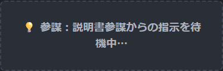

# 3301 UI 仕様 — ビジュアル版（スクショ付き）

テキスト詳細版: [`ui_spec_summary.md`](ui_spec_summary.md)  
操作手順: [`user_manual.md`](user_manual.md)

> スクショ再取得: `python scripts/capture_doc_screenshots.py`  
> 取得元: https://3301-svs.jp/ （2026-05-23）

---

## 0. 画面一覧

| 画面 | スクショ | DOM |
|------|----------|-----|
| 入口（モード＋端末） |  | `#step1_intro` |
| 練習ルーム入口 |  | `#step2_5_alliance` |
| メイン（参謀） |  | `#display` |
| メイン（参加者待機） |  | `#departureBox` |
| 総指揮 |  | `index.html` |

---

## 2. オンボーディング UI

### 2-1. モード選択

| 要素 | 仕様 |
|------|------|
| 練習 | 紫 `#C678DD`・「同盟の練習」 |
| SVS | 金 `#E5C07B`・「SVS 3301全体」 |

### 2-2. 練習ルーム（作成 / 参加）

| タブ | 内容 |
|------|------|
| 作成 | 同盟名 + 参加コード → 作成して入る |
| 参加 | ルーム一覧（**同盟名のみ**）+ 参加コード |

### 2-3. SVS 同盟選択

XYZ / MTC / APL の 3 行。選択後に役割ブロックが展開。

### 2-4. 役割選択

| ボタン | 色 | 備考 |
|--------|-----|------|
| 参謀 | 金 `#E5C07B` | 下に「参謀として参加するプレイヤー役割」 |
| 集結主 第1/2班 | 緑/灰 | 名前必須 |
| 乗り手 | 灰 | 名前欄非表示 |

---

## 3. メイン画面（`#display`）

### 3-0. 役割別構成（共通ヘッダ）

全役割共通:

- UTC 時刻・音声準備表示
- 同盟名 `【 TEST 】` + モードバッジ（**同盟練習** / SVS）
- **人数行** `#alliancePresenceLine`: 参謀 / 集結主 / 乗り手（参謀は名前付き可）

### 3-1. 参謀

- 中央: 「参謀として参加中」（青点線枠）
- 下部: `#staffCommandPanel`

### 3-2. 集結主 / 乗り手（待機）

参謀在室時:

- 「参謀：{名前}からの指示を待機中…」（灰点線）

参謀不在時:

- 「参謀がルーム内にいません」（赤点線 + 参加手順）

### 3-3. 指令カード（`#departureBox`）

集結・差込・入替・抜き指示後に表示。詳細レイアウトは [`ui_spec_summary.md`](ui_spec_summary.md) **§9**。

---

## 4. 参謀用パネル（`#staffCommandPanel`）

| 領域 | 内容 |
|------|------|
| 集結時間 | 5分 / 1分 ラジオ |
| 小隊行 | 集結主名・着弾 UTC 調整・**集結開始** |
| 下部 | 設定変更・SOS |

---

## 6. 総指揮画面 UI 概要

3 列（同盟）× 敵行 + 号令パネル + 手動操作（差込/入替/抜き）。

---

## 8. モード別差分（スクショで確認できる範囲）

| 項目 | drill（練習） | prod（SVS） |
|------|---------------|-------------|
| 入口 | ルーム作成/参加 | 3 同盟選択 |
| バッジ | 同盟練習（紫） | SVS（金） |
| 参謀パネル | あり | なし（総指揮画面で操作） |
| 配置図ボタン | 非表示 | 表示可 |

---

## テキスト仕様との対応

| 本資料の章 | ui_spec_summary.md |
|------------|-------------------|
| §2 | §2 オンボーディング |
| §3 | §3 メイン、§3-0 役割別 |
| §4 | §4 参謀パネル |
| §6 | §6 総指揮 |
| 指令カード詳細 | §9・§10（スクショは号令発火後に追加予定） |

---

## 更新履歴

| 日付 | 内容 |
|------|------|
| 2026-05-23 | 初版（本番スクショ 15 枚） |
