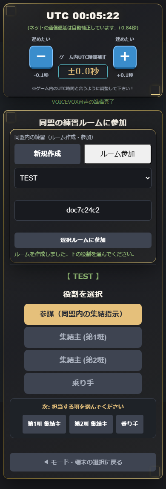

# 3301 Web 操作説明書（スクショ付き）

本番 URL: **https://3301-svs.jp/**  
総指揮 URL: **https://3301-svs.jp/staff_hq_3301**

> スクショは本番（3301-svs.jp）から自動取得しています。  
> 再取得: `python scripts/capture_doc_screenshots.py`

**関連資料**

| 資料 | 内容 |
|------|------|
| [ui_spec_visual.md](ui_spec_visual.md) | UI 仕様（画面・レイアウト）＋スクショ |
| [operation_spec_visual.md](operation_spec_visual.md) | 操作・ロジック仕様＋スクショ |
| [ui_spec_summary.md](ui_spec_summary.md) | UI 仕様（テキスト詳細版） |
| [operation_spec_summary.md](operation_spec_summary.md) | 操作仕様（テキスト19版） |

---

## 1. はじめに

3301 Web は、同盟の **集結タイミング** を UTC で揃えるためのツールです。

| 誰が | 何をする |
|------|----------|
| **参謀** | 練習ルームを作る／集結指示を出す |
| **集結主・乗り手** | ルームに入り、指示に従ってタイマーを見る |
| **総指揮** | SVS 本番で 3 同盟を横断操作（差込・入替・集結・抜き） |

**呼称（画面に出る言葉）:** 総指揮 / 参謀 / 集結主 / 乗り手 / 第1班・第2班  
（司令官・リーダー・班長 などは使いません）

---

## 2. 初回セットアップ（全員共通）

### 2-1. 入口を開く

ブラウザで https://3301-svs.jp/ を開きます。

### 2-2. モードを選ぶ

| ボタン | 用途 |
|--------|------|
| **同盟の練習** | 同盟内の訓練・リハーサル（ルーム作成・参加コード） |
| **SVS 3301全体** | 本番 SVS（XYZ / MTC / APL の 3 同盟） |

### 2-3. 端末環境を選ぶ

| 選択 | 意味 |
|------|------|
| **はい（別端末で開ける）** | PC＋スマホなど **2 台**。号令の自動音声（10 秒カウント等）が有効 |
| **いいえ（スマホ1台のみ）** | 1 台運用。自動音声なし。大きな時計表示が主 |

**2 台運用を推奨**（参謀 PC ＋ 参加者スマホなど）。

---

## 3. 同盟の練習（drill）— 参謀がルームを作る

### 3-1. 練習ルーム画面

「同盟の練習」を選ぶと、**作成** と **参加** のタブが出ます。

### 3-2. ルーム作成

1. **作成** タブを開く  
2. **同盟名**（例: `TEST`）と **参加コード**（例: `abc123`）を入力  
3. **作成して入る** をタップ

作成が成功すると、下に **役割選択** が表示されます。

> **参加コード** をメンバーに共有してください。同じコードで「参加」タブから入れます。

### 3-3. 参謀として登録

1. **参謀（同盟内の集結指示）** を選ぶ  
2. 参謀自身のプレイヤー役割（第1班集結主 / 第2班 / 乗り手）を選ぶ  
3. **参謀名** を入力（必須）  
4. **登録して開始**

### 3-4. 参謀メイン画面

登録後、メイン画面に入ります。

- 上部: 同盟名・**同盟練習** バッジ・**参謀 / 集結主 / 乗り手** の人数  
- 中央: 「参謀として参加中」  
- 下部: **参謀用パネル**（集結指示を出す）

**参謀用パネルでできること**

- 集結時間（5分 / 1分）の切替  
- 各集結主へ **集結開始** 指示  
- 着弾時刻（UTC）の指定  

---

## 4. 同盟の練習 — 参加者がルームに入る

### 4-1. 参加タブ

1. **参加** タブを開く  
2. 一覧から同盟名（例: `TEST`）を選ぶ ※ `(1人)` や `#xxxx` は付きません  
3. 参謀から教わった **参加コード** を入力  
4. **選択ルームに参加**

### 4-2. 役割を選んで登録

| 役割 | 誰が選ぶ |
|------|----------|
| 集結主（第1班 / 第2班） | その班の担当者（名前入力必須） |
| 乗り手 | 乗り手担当（名前不要） |

**登録して開始** でメイン画面へ。

### 4-3. 参謀の指示を待つ

参謀がルーム内にいると:

- 人数表示: **参謀 1名**（名前付き）  
- 待機メッセージ: **「参謀：○○からの指示を待機中…」**

参謀がいない場合は赤枠で **「参謀がルーム内にいません」** と表示されます。  
→ 参謀にも同じルーム・参加コードで入ってもらい、**参謀** 役割で登録してもらってください。

### 4-4. 集結指示が来たら

参謀が集結を指示すると、中央の **指令カード**（`#departureBox`）に:

- **集結中** のカウントダウン  
- **着弾時間 (UTC)**  

が表示されます。2 台運用では 18 秒前予告・10 秒カウントの音声も鳴ります。

---

## 5. SVS 3301全体（prod）

本番 SVS 用です。同盟 **XYZ / MTC / APL** のいずれかを選び、役割登録後にメイン画面へ進みます。

練習と違い **ルーム作成は不要** です。総指揮画面から全同盟へ指示が出ます。

---

## 6. 総指揮画面（本番 SVS 専用）

URL: https://3301-svs.jp/staff_hq_3301

3 同盟を横断して、次の操作ができます。

| 操作 | 内容 |
|------|------|
| 集結号令 | 各小隊へ着弾時刻を指定 |
| 差込 | 占領同盟のみ・敵着弾に合わせた差込 |
| 占領入替 | 入替タイミングの指示 |
| 占領抜き | 抜きタイミングの指示 |

詳細ロジックは [operation_spec_visual.md](operation_spec_visual.md) §4 を参照。

---

## 7. よくある操作

### 設定を変更する

メイン画面下部の **⚙️ 設定を変更する** → 役割・名前を選び直して **登録して開始**。

### 画面を切り替えたあと参謀が「0名」になる

アプリをバックグラウンドにしたり更新した直後に一時的にずれることがあります。  
**参謀端末・参加者端末の両方で一度更新（F5）** してください。

### 質問・SOS

メイン画面下部 **質問・SOS窓口（総指揮・AI副官）** から質問できます（ゲーム操作とは別機能）。

---

## 8. スクショ一覧

| ID | 画面 | ファイル |
|----|------|----------|
| 01 | 入口・モード選択 | `screenshots/01_entry_mode.png` |
| 02 | 同盟の練習選択 | `screenshots/02_drill_mode_selected.png` |
| 03 | 練習ルーム入口 | `screenshots/03_drill_join_hub.png` |
| 04 | ルーム作成フォーム | `screenshots/04_drill_create_form.png` |
| 05 | 作成完了・役割 | `screenshots/05_drill_create_done_role.png` |
| 05b | 参加一覧 | `screenshots/05b_drill_join_list.png` |
| 06 | 参謀役割選択 | `screenshots/06_role_staff_pick.png` |
| 07 | 参謀名入力 | `screenshots/07_role_staff_rider_name.png` |
| 08 | 乗り手選択 | `screenshots/08_role_rider_pick.png` |
| 09 | 参謀メイン | `screenshots/09_staff_main.png` |
| 10 | 参謀用パネル | `screenshots/10_staff_command_panel.png` |
| 11 | 人数表示行 | `screenshots/11_presence_line_staff.png` |
| 12 | 参加者待機 | `screenshots/12_joiner_waiting_staff.png` |
| 13 | 待機ボックス | `screenshots/13_departure_waiting.png` |
| 14 | SVS 同盟選択 | `screenshots/14_prod_alliance_pick.png` |
| 15 | 総指揮画面 | `screenshots/15_staff_hq_overview.png` |

---

## 更新履歴

| 日付 | 内容 |
|------|------|
| 2026-05-23 | 初版（本番スクショ自動取得・操作説明書） |

