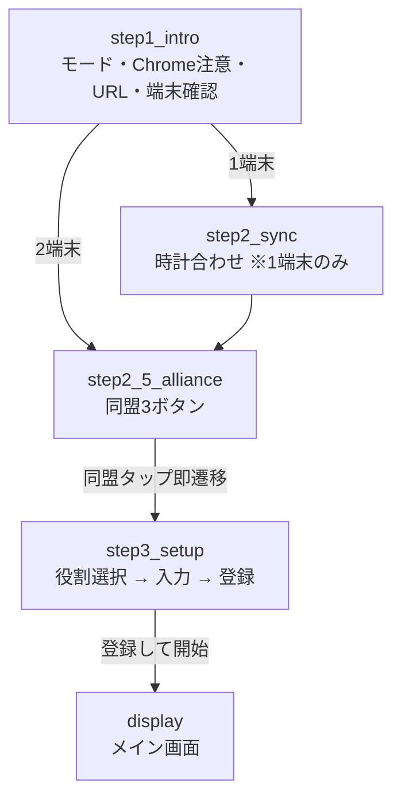
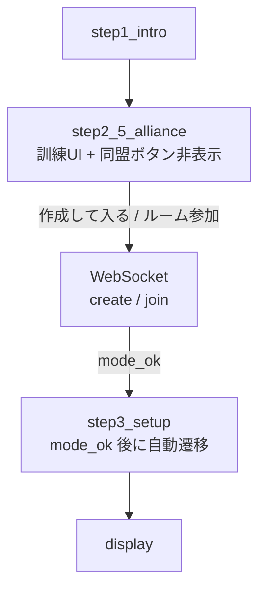

# UX 監査レポート — 同盟選択〜役割選択

> **最新:** 案A（縦2カード・SVS文案）実装後の再監査は [`ux_audit_v2.md`](ux_audit_v2.md) を参照。

| 項目 | 内容 |
|------|------|
| 対象 | `player.html` オンボーディング（環境確認 → 同盟/訓練ルーム → 役割・登録） |
| 本番 URL | https://3301-svs.jp/ |
| 監査日 | 2026-05-19（初回） |
| 方法 | コードレビュー（`player.html` 構造・遷移・入力・エラー処理） |
| スコープ外 | メイン画面（タイマー・参謀パネル）、スタッフ画面、サポートチャット詳細 |

---

## サマリー

機能は揃っている一方、**「今どの段階か分からない」「訓練モードの流れが1画面に詰まっている」「エラーが alert で遮断される」** の3点が操作性を下げている。

**最優先で直すと効果が大きいのは次の3つ:**

1. ステップインジケータ（進捗の見える化）
2. 訓練ルーム参加フローの画面分離と成功時の明示
3. `alert()` をインラインエラー表示へ置き換え

---

## 現状フロー（本番 / 1端末）



## 現状フロー（訓練モード）



---

## 発見事項（優先度順・最大10件）

### #1 【P0】進捗（ステップ）が見えない

| | |
|--|--|
| **問題** | `step1_intro` → `step2_sync`（任意）→ `step2_5_alliance` → `step3_setup` とカードを `display:none` で切り替えているが、**「全体の何割か」が画面上にない**。 |
| **影響** | 初回ユーザーが「あと何回戻れるか／あと何画面か」分からず、長い step1（警告・URL・端末）で離脱しやすい。 |
| **提案** | 画面上部に固定のステップバー（例: `①環境 → ②同盟 → ③役割`）。1端末時は `①環境 → ②時計 → ③同盟 → ④役割`。 |
| **工数目安** | 小（HTML + CSS + `hideAllSteps` 時に active 更新） |
| **該当** | `player.html` L394–456, `hideAllSteps`, `selectEnv`, `confirmSync` |

---

### #2 【P0】訓練モードの「参加完了」が分かりにくい

| | |
|--|--|
| **問題** | 訓練は `step2_5_alliance` 内のタブ（新規作成 / ルーム参加）と入力欄のみ。成功後は `mode_ok` で **無言に** `selectAlliance(0)` → `step3_setup`（L2568–2584）。待ち中は `drillStatusMsg` のみ。 |
| **影響** | 「作成して入る」を押したあと画面が変わらない時間があり、**失敗か成功か判断できない**。以前の「同盟画面に戻る」系の不具合報告とも相性が悪い。 |
| **提案** | ① 送信中はボタン無効化 + スピナー ② 成功時は緑の完了バナー「ルームに参加しました → 役割を選んでください」③ 失敗は #3 のインライン表示。 |
| **工数目安** | 中 |
| **該当** | `createDrillRoom`, `joinDrillRoom`, `sendWsCommandWithRetry`, `mode_ok` / `mode_error` ハンドラ |

---

### #3 【P0】入力エラーが `alert()` 依存

| | |
|--|--|
| **問題** | 訓練作成・参加・登録で未入力時に `alert()`（L1300–1301, 1317–1318, 2447–2458 等）。 |
| **影響** | モバイルでダイアログが重い・キーボードと被る・連続ミスでストレス。訓練の `setDrillStatus` は良い対比（インライン）。 |
| **提案** | 同盟/訓練/役割ブロック共通の `showFieldError(fieldId, message)`。該当 input に赤枠 + 直下に文言。`alert` は通信致命エラーのみ残す。 |
| **工数目安** | 中 |
| **該当** | `createDrillRoom`, `joinDrillRoom`, `register`, `setRole` 周辺 |

---

### #4 【P1】訓練と本番が同一カードに同居

| | |
|--|--|
| **問題** | `step2_5_alliance` に `drillConfigArea` と同盟ボタン3つが同居。訓練時は `btnAln1/2` を非表示（L1174–1176）するが、**レイアウトの余白・見出しが本番用のまま**。 |
| **影響** | 「同盟を選ぶのか、ルームを作るのか」が一瞬混乱。本番ユーザーには訓練 UI が見えないのは良い。 |
| **提案** | `appMode === 'drill'` のときは同盟ボタン領域を丸ごと非表示（display:none でブロック分離）。見出しを「訓練ルーム」専用コピーに。 |
| **工数目安** | 小 |
| **該当** | `selectAppMode`, `step2_5_alliance` HTML |

---

### #5 【P1】参謀ロールが「2段階」であることが伝わらない

| | |
|--|--|
| **問題** | `setRole('staff')` で `staffPlayerRoleArea` 表示、`inputsArea` は非表示（L2379–2393）。**第1班/第2班/乗り手のサブ選択**後に `setStaffPlayerRole` で初めて名前・登録が出る。 |
| **影響** | 「参謀を押したが次に何をすればいいか」が弱い。`register` ボタンが見えず止まったように感じる。 |
| **提案** | 参謀選択直後に説明文「参謀として操作する班を選んでください」+ サブボタンを大きく。未選択時は登録ボタンをグレーアウト表示（非表示ではなく）。 |
| **工数目安** | 小〜中 |
| **該当** | `step3_setup` L434–441, `setRole`, `setStaffPlayerRole` |

---

### #6 【P1】同盟タップで即 `step3` — 誤タップに弱い

| | |
|--|--|
| **問題** | `selectAlliance(idx)` は確認なしで即 `step3_setup`（L1538–1547）。 |
| **影響** | スマホの誤タップで別同盟の役割画面へ。戻るは「◀ 同盟の選択に戻る」で可能だが1タップ多い。 |
| **提案** | 軽い確認（選択中ハイライト → 「この同盟で進む」1ボタン）または 長押し確認。頻繁利用者向けに「次回から確認しない」チェック（localStorage）。 |
| **工数目安** | 小 |
| **該当** | `selectAlliance`, `btnAln0–2` |

---

### #7 【P1】step1 が情報過多で同盟まで遠い

| | |
|--|--|
| **問題** | step1 にモード切替・Chrome警告・URLコピー・端末質問が縦に並ぶ（L374–392）。その間も上部に UTC 時計・VOICEVOX 準備表示。 |
| **影響** | 「使い始めるまでの道のり」が長く感じる。目的が同盟選択のユーザーには冗長。 |
| **提案** | Chrome/URL を折りたたみ（「初めての方だけ開く」）。端末質問を最上部に。時計・音声はオンボーディング中は簡略表示。 |
| **工数目安** | 中 |
| **該当** | `step1_intro`, `topClockArea`, `voiceReadyStatus` |

---

### #8 【P2】訓練の「ルーム選択 + 参加コード」の意味が不明

| | |
|--|--|
| **問題** | 参加タブで `drillRoomSelect` と `drillJoinCodeInput` の両方必須（L1314–1318）。ルーム名だけでは参加できない理由が UI 上にない。 |
| **影響** | コードをどこから得るか迷う。同盟内共有前提が placeholder のみ。 |
| **提案** | ルーム選択後に「このルームの参加コードを入力（参謀から共有）」のヘルプ1行。作成タブではコードを **作成後に表示・コピー** ボタン。 |
| **工数目安** | 小（文言 + 作成成功時 UI） |
| **該当** | `drillJoinArea`, `createDrillRoom`, `mode_ok` |

---

### #9 【P2】モード選択が再起動でリセットされる

| | |
|--|--|
| **問題** | `localStorage` に `utc_app_mode` を保存（L1164）するが、`window.onload` で **常に** `selectAppMode("prod")`（L2353）。`savedMode` は読むが未使用（L2342）。 |
| **影響** | 訓練モード利用者が毎回【訓練】を再タップ。入力値（同盟名・コード）は復元されるがモードだけ戻る。 |
| **提案** | `onload` で `selectAppMode(savedMode || qsMode || 'prod')`。 |
| **工数目安** | 極小 |
| **該当** | `window.onload`, `selectAppMode` |

---

### #10 【P2】タップ領域・キーボードまわり

| | |
|--|--|
| **問題** | `.role-btn` は padding 12px・幅80%（L22）で概ね良好。一方、訓練タブ・`btn-back`・`btn-gray` は padding 8–10px とやや小さめ。`input[type=number]` はモバイルでスピナー UI。 |
| **影響** | 片手操作・手套えで押しづらい。行軍時間入力でキーボードがボタンを隠す端末あり。 |
| **提案** | 主要 CTA は最小高さ 48px。訓練タブも同様。行軍入力表示時は `inputsArea` を `scrollIntoView`。 |
| **工数目安** | 小（CSS 中心） |
| **該当** | `<style>` L22–54, `inputsArea` |

---

## ヒューリスティクス簡易評価

| 原則 | 評価 | メモ |
|------|------|------|
| システム状態の可視性 | △ | 訓練 WS 待ち・接続中は一部良い（`setDrillStatus`） |
| 現実世界との一致 | ○ | 同盟名・班・参謀はゲーム用語で一致 |
| ユーザーの制御と自由 | △ | 戻るはあるが誤タップ・alert で阻害 |
| 一貫性 | △ | エラー表示が alert とインライン混在 |
| エラー防止 | △ | 必須入力はあるが事前ガイド弱い |
| 記憶より認識 | △ | 参謀2段階・参加コードが負荷 |
| 柔軟性と効率 | ○ | 2端末スキップ、localStorage 一部あり |

---

## 推奨実装フェーズ

| フェーズ | 内容 | 含める # |
|----------|------|----------|
| **A（すぐ）** | ステップバー、alert→インライン、訓練成功/失敗の明示、savedMode 復元 | #1 #3 #2 #9 |
| **B（短期）** | 訓練UI分離、参謀ガイド、同盟確認1ステップ | #4 #5 #6 |
| **C（中期）** | step1 折りたたみ、参加コード UX、タップサイズ | #7 #8 #10 |

各フェーズは **1〜3項目ずつ** 実装 → 本番確認 → 次、が安全（既存の自動デプロイ・QA ループと相性良い）。

---

## 実装時の注意（本番）

- 変更ファイルは主に `player.html`（デプロイ対象）。
- 訓練ルームの WebSocket フロー（`mode_ok` / `mode_error`）は **触る場合はリグレッション QA 必須**（`.cursor/qa_checklist.md` の訓練ルーム項目）。
- デザイン統一は `.cursor/rules/ui-design.mdc` を参照。

---

## 次のアクション（ユーザー向け）

チャットで例:

> ux_audit の #1 と #3 だけ実装して

> フェーズ A を全部やって

---

## スマホ画面でも監査は有効か？

**結論: はい。有効どころか、スマホ利用を前提にした監査として読むのが正しい。**

| 観点 | 内容 |
|------|------|
| 監査方法 | コード上の HTML/CSS/JS と遷移のレビュー。実機のタッチ検証は **未実施**（別途スマホ実機 QA 推奨）。 |
| スマホ前提の根拠 | `viewport` 設定あり（`width=device-width`）、`touch-action: manipulation`、`user-scalable=no`。step1 で「スマホ1台のみ」分岐あり。 |
| スマホで特に効く指摘 | #3 `alert()`、#1 進捗不明、#2 訓練の待ち、#6 誤タップ、#10 タップ領域 — **いずれもモバイルで体感が悪化しやすい**。 |
| スマホ限定の追加注意 | キーボードで入力欄・登録ボタンが隠れる、縦長 step1 のスクロール疲れ、片手操作での戻るボタン位置。 |

**補足:** 監査時点のスクリーンショット（同盟3ボタン等）もモバイル幅の UI と一致。PC 専用の問題より、**スマホ＋Discord 内ブラウザを避ける** という既存メッセージと整合している。

---

## モード名称・選択 UX の提案（SVS 本番 vs 同盟訓練）

### 利用実態（整理）

| 現ラベル | 実際の用途 | 利用頻度・範囲 |
|----------|------------|----------------|
| 本番用 | **SVS**（4週に1回程度）— **3301サーバー全体** | 低頻度・高重要 |
| 訓練 | **同盟単位の練習** — ルーム作成・参加コード共有 | 高頻度・同盟内 |

「本番／訓練」は開発者向けの言葉に近く、プレイヤーには **「SVS か、普段の同盟練習か」** が伝わりにくい。  
また「【本番用】只今調整中…」は SVS 本番の重要性と矛盾し、**迷い・不安** を生む。

### 命名の原則

1. **イベント名（SVS）と利用範囲（3301全体 / 自同盟）** を短く見せる  
2. 「本番」という言葉はユーザー向け UI では避ける（サーバー用語と混同）  
3. 頻度の違いを **脅しではなく説明** する（「4週に1回」「いつでも練習」）  
4. 選択は **2枚のカード**（タイトル + 1行説明 + 選ぶ）がスマホで押しやすい  

---

### 文案案（推奨順）

#### 案A — おすすめ（目的が一目で分かる）

| 位置 | 現状 | 提案 |
|------|------|------|
| モード選択（大） | 【本番用】只今調整中… | **SVS（3301全体）** |
| サブ | （なし） | 4週に1回のサーバー対抗戦。全同盟が同じ戦場で使用 |
| モード選択（大） | 【訓練】参謀主導 | **同盟の練習** |
| サブ | （なし） | 自同盟だけの部屋。普段の打ち合わせ・訓練用 |
| バッジ（メイン画面） | 【本番】/【訓練】 | **SVS** / **同盟練習** |
| 同盟ステップ見出し | SVS参加する同盟の選択 | **参加する同盟を選ぶ**（SVS 時） |
| 訓練ステップ見出し | 訓練ルームに参加 | **同盟の練習ルームに参加** |

#### 案B — SVS を前面に（イベント週向け）

- **SVS 本番モード** — 3301サーバー全員・今回の SVS 用  
- **同盟訓練モード** — 同盟内だけ・何度でも練習  

SVS 開催週は step1 上部に帯表示:  
`今週は SVS 週です →「SVS（3301全体）」を選んでください`

#### 案C — 最小変更（コード上の `prod` / `drill` はそのまま）

- ボタンの表示文字だけ差し替え  
- 「本番用」「訓練」という語は画面から削除  

---

### 選択 UI の提案（やりやすさ）

```text
┌─────────────────────────────────────┐
│  どちらで使いますか？                  │
├─────────────────────────────────────┤
│  ┌───────────────────────────────┐  │
│  │  SVS（3301全体）               │  │  ← 高さ十分・全面タップ
│  │  4週に1回・サーバー全員の本戦    │  │
│  └───────────────────────────────┘  │
│  ┌───────────────────────────────┐  │
│  │  同盟の練習                     │  │
│  │  自同盟だけ・ルームで何度でも   │  │
│  └───────────────────────────────┘  │
│  ※ 普段は「同盟の練習」、SVSの日は上を選択   │
└─────────────────────────────────────┘
```

| # | 提案 | 理由 |
|---|------|------|
| 1 | 横並び2ボタン → **縦2カード** | スマホで説明文を読んでから押せる |
| 2 | **前回選択を記憶**（`utc_app_mode` を onload で復元） | 同盟練習の常連が毎回「本番」に戻る問題を解消（監査 #9） |
| 3 | SVS 週だけ **上カードを強調**（色・帯） | 低頻度イベントの取りこぼし防止 |
| 4 | URL で入口分け（既存 `?mode=` の活用） | 参謀が Discord で「練習用リンク」「SVS用リンク」を別配布 |
| 5 | 選んだあと **画面上部に固定バッジ**（`modeBadge`） | メイン中も「今 SVS か同盟練習か」が分かる |
| 6 | 「只今調整中」を削除 or SVS 非開催時のみ表示 | SVS＝本番という理解と矛盾しない |

---

### ユーザー像ごとの迷いと対策

| ユーザー | 迷い | 対策 |
|----------|------|------|
| 普段の同盟メンバー | 「本番」と「訓練」どちらが日常用か | デフォルト表示を **同盟の練習** に（利用頻度が高いため）。SVS 週はバナーで上書き |
| SVS 当日の参加者 | 訓練ルームに入ってしまう | SVS 週は step1 で SVS カードを先に・大きく。文言で「今日はこちら」 |
| 参謀 | 練習ルーム作成と SVS の参謀操作の違い | 同盟練習時のみ「ルーム作成・参加コード」ブロック。SVS 時は従来の3同盟選択のみ |
| 新規 | 3301全体と同盟だけの違い | カードのサブ1行に範囲を明記（**3301全体** / **自同盟だけ**） |

---

### 実装時の文言マッピング（案A・開発用）

| 内部値 `appMode` | UI 表示（ユーザー向け） |
|------------------|-------------------------|
| `prod` | SVS（3301全体） |
| `drill` | 同盟の練習 |

`selectAppMode` / `modeBadge` / `allianceStepTitle` / エラーメッセージ内の「訓練モード」も同じ語彙に揃える。

---

### 監査項目との対応

| 新提案 | 関連する既存 # |
|--------|----------------|
| モード2カード化 | #7（step1 整理）、#4（訓練UI分離） |
| 文案変更 | #7、#8 |
| 前回モード復元 | #9 |
| SVS 週バナー | 新規（低工数・高効果） |

---

*本ドキュメントはコード変更を伴わない監査成果物です。実装は別タスクで行ってください。*
