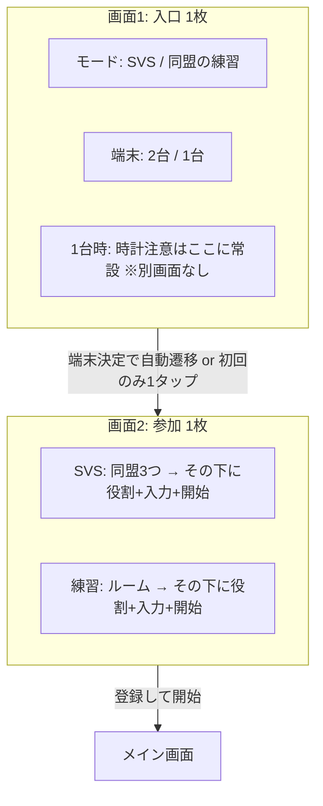

# UX 再監査 v3 — タップ数・画面数の最小化


| 項目  | 内容                                                   |
| --- | ---------------------------------------------------- |
| 方針  | **無駄な確認（OK？ダイアログ）は増やさない**。必須の選択は残し、**画面の枚数と遷移**を減らす。 |
| 前提  | スマホ・同盟練習が高頻度、SVSは4週に1回（案A文案済み）                       |
| 対象  | `player.html` オンボーディング                               |
| 前回  | `ux_audit_v2.md`                                     |
| 監査日 | 2026-05-19                                           |


---

## 現状の「コスト」計測

### 画面切り替え（フルカード `hideAllSteps`）


| 経路                | 画面数（開始→メイン）           | 内訳                                   |
| ----------------- | --------------------- | ------------------------------------ |
| **SVS・2端末**（最多想定） | **3枚**                | step1 → step2_5 → step3 → display    |
| **SVS・1端末**       | **4枚**                | step1 → step2_sync → step2_5 → step3 |
| **同盟練習・2端末**      | **3枚**                | 同上（step2_5 はルームUI）                   |
| **同盟練習・作成**       | 3枚 + **入力2〜3 + ボタン1** | 同盟名・コード・作成して入る                       |


### タップ数（確認ダイアログ除く・初回・最小）


| 経路          | 必須タップ目安 | 内訳                                     |
| ----------- | ------- | -------------------------------------- |
| SVS・2端末・乗り手 | **4**   | 端末1 + 同盟1 + 役割1 + 登録1（モードは記憶で0可）       |
| SVS・2端末・集結主 | **4〜5** | 上 + 名前入力はキーボード                         |
| SVS・1端末     | **+1**  | 「時間合わせOK！」が **専用画面の1タップ**              |
| 同盟練習・参加     | **5〜6** | 端末1 + ルーム選択1 + コード入力 + 参加1 + 役割1 + 登録1 |
| 同盟練習・参謀     | **+1**  | 班選択が **追加タップ**（画面は同じ）                  |


### 無駄になりやすい要素（現状）


| 要素                      | 種類         | 削減可否                 |
| ----------------------- | ---------- | -------------------- |
| step1 の Chrome警告・URLコピー | スクロール・注意分散 | **初回のみ表示**にできる       |
| step2_sync 専用画面         | 画面+1タップ    | **1端末でも画面を分けない**方がよい |
| 同盟タップ → **別画面**で役割      | 画面+0タップ    | **同一画面内展開**にできる      |
| 同盟確定の「OK？」              | 確認         | **採用しない**（ご要望どおり）    |
| `alert` 未入力             | 疑似確認       | **インライン**に（タップは増えない） |
| 参謀の班選択後に登録表示            | タップ+迷い     | **参謀タップで班+名前を同時表示**  |


---

## 理想に近づける設計原則

1. **1画面 = 1つの目的** にまとめる（モードと端末は「入口」、参加と役割は「参加」）
2. **選んだら下に伸びる**（アコーディオン）— 画面は切り替えない
3. **記憶できるものは記憶**（モード・端末・同盟・役割）— タップを0に近づける
4. **確認ダイアログは禁止** — 誤タップは「戻る」1タップで修正（同盟の二段階確認は入れない）
5. **SVS週だけ** 入口で SVS カードを強調（画面は増やさない）

---

## 提案：画面を「最大2枚」に圧縮

### 新フロー概要




|                 | 現状  | 提案          |
| --------------- | --- | ----------- |
| 画面数（2端末）        | 3〜4 | **2**       |
| 画面数（再訪・ショートカット） | 3   | **0〜1**（下記） |


---

## 提案A【推奨】画面2で「同盟＋役割」を一体化

### 実装イメージ（SVS）

1枚のカード `step_join` 内に常時表示:

```
[ 参加する同盟 ]  ← 見出しのみ
[ MTC ] [ APL ] [ --- ]   ← 1タップで選択＋ハイライト（画面遷移なし）

▼ 選択後に同じカード内で表示（selectAlliance で hideAllSteps しない）
[ 役割を選択 ]
[ 参謀 ] [ 第1班 ] [ 第2班 ] [ 乗り手 ]
（入力欄）
[ 登録して開始 ]
```


| 効果  | 詳細                              |
| --- | ------------------------------- |
| 画面  | step3 を廃止 → **-1画面**            |
| タップ | 同盟1 + 役割1 + 登録1 は **不変**（必須のため） |
| 確認  | **追加しない**                       |


### 同盟練習

- ルーム作成/参加ブロックの **直下** に同じ「役割＋登録」ブロックを置く
- `mode_ok` 後は `selectAlliance(0)` で **画面遷移せず** `showRoleSection()` のみ


| 効果  | 詳細                          |
| --- | --------------------------- |
| 画面  | 役割専用画面を廃止 → **-1画面**        |
| 体感  | 「入れたのに何も起きない」を解消（v2 #2 と一体） |


---

## 提案B 画面1で「モード＋端末」を完了させる

### 現状の問題

- モードは選べるが、**端末ボタンまでスクロール**が必要
- 端末選択で **別画面**（sync または alliance）に飛ぶ

### 提案


| 変更        | 内容                                                |
| --------- | ------------------------------------------------- |
| 端末を記憶     | `localStorage.utc_device_mode` を保存・復元（モードと同様）     |
| 2端末をデフォルト | 初回未設定時は「2端末」前提（スマホ+PCが主戦場なら）                      |
| 1端末の時計    | step2_sync を廃止し、**画面2の上**に細いバナー「秒まで合わせてから開始」＋時計表示 |
| 自動進行      | モード＋端末が揃ったら **0.3秒後に画面2へ**（「次へ」ボタンなし）             |


| 効果      | 詳細                          |
| ------- | --------------------------- |
| 画面（1端末） | **-1画面**（sync削除）            |
| タップ（再訪） | 端末0 + 画面遷移0 → **画面2から開始可能** |


---

## 提案C【再訪ユーザー】1タップでメイン（任意・効果大）

必須選択を「毎回やり直し」にしない。**変更したい人だけ**画面2へ。

### 条件（例）

- `utc_last_role` / `utc_my_name` / `utc_app_mode` / `utc_device_mode` あり
- 同盟練習なら `utc_drill_room_key` 有効
- WebSocket 接続OK

### UI（画面1またはURL直後）

```
前回: 同盟の練習 / MTC / 乗り手（行軍 0:30）
[ そのまま開始 ]  [ 設定を変える ]
```


|        | タップ    | 画面       |
| ------ | ------ | -------- |
| そのまま開始 | **1**  | 0（メイン直結） |
| 設定を変える | 1 + 通常 | 2        |


**注意:** SVS当日に同盟だけ変えたい人は「設定を変える」— 無理に自動開始しない。

---

## 提案D 削らないもの（ご要望との整合）


| 項目              | 理由                        |
| --------------- | ------------------------- |
| モード（SVS / 同盟練習） | サーバー全体 vs 同盟内でサーバ挙動が違う    |
| 端末（2台 / 1台）     | 音声・時計の挙動が違う               |
| 同盟（SVS時3択）      | ゲーム上必須                    |
| 役割              | ゲーム上必須                    |
| 参謀の班            | 操作対象が違う（**画面は分けずタップは維持**） |
| 登録して開始          | サーバ登録の明示トリガー              |


| 採用しないもの         | 理由                   |
| --------------- | -------------------- |
| 「この同盟でよいですか？」   | 無駄な確認（**v2 #5 は却下**） |
| ステップごとの「OK」     | 同上                   |
| 追加のモーダル `alert` | タップ＋中断               |


---

## タップ・画面の目標値


| ペルソナ         | 現状（画面/タップ） | 目標（画面/タップ）             |
| ------------ | ---------- | ---------------------- |
| SVS・2端末・リピータ | 3 / 3〜4    | **1〜2 / 2〜3**（提案B+C+A） |
| SVS・初回       | 3〜4 / 4〜5  | **2 / 4**（必須4選択は維持）    |
| 同盟練習・リピータ    | 3 / 5〜6    | **1〜2 / 2〜4**          |
| 同盟練習・参謀・初回   | 3 / 6+     | **2 / 5**（画面統合で-1）     |


---

## 実装フェーズ（タップ最小化優先）


| 順     | 内容                                  | 画面削減    | タップ削減      | 工数      |
| ----- | ----------------------------------- | ------- | ---------- | ------- |
| **1** | 提案A: 同盟+役割を同一カード（`hideAllSteps` 廃止） | -1      | 0          | 中       |
| **2** | 提案B: sync画面廃止・端末記憶・自動で画面2へ          | -1（1端末） | 0〜1        | 中       |
| **3** | step1のChrome/URLを初回折りたたみ            | 0       | 0（スクロール削減） | 小       |
| **4** | 練習: mode_ok で役割ブロック展開のみ             | 0       | 0          | 小（Aに含む） |
| **5** | 提案C: 「そのまま開始」                       | -1〜2    | **-2〜3**   | 中       |
| **6** | インラインエラー（alert廃止）                   | 0       | 0（中断削減）    | 中       |


**やらない:** 同盟二段階確認、ステップバーだけ増やす単独実装（画面は減らない）

---

## v2 指摘との関係


| v2            | v3での扱い                                     |
| ------------- | ------------------------------------------ |
| #1 ステップインジケータ | **任意** — 2画面化すれば「画面1/2」程度で足りる。細かいバーは必須ではない |
| #2 訓練成功表示     | **提案Aと同時** — 同一画面展開が本体                     |
| #3 alert      | **継続推奨** — 確認ではないが操作中断                     |
| #5 同盟確認       | **却下**                                     |
| #7 カード順（練習を上） | **推奨維持** — タップは同じ、誤選択減                     |


---

## 次のチャット指示例

```
ux_audit_v3 のフェーズ1+2（同盟役割同一画面、sync廃止、端末記憶）を実装して
```

```
まず提案Aだけ。確認ダイアログは絶対入れないで
```

---

*コード変更なし。実装は別タスク。*